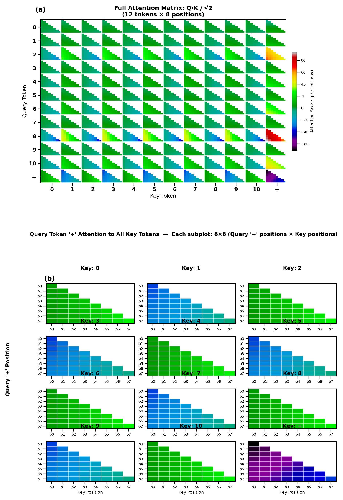
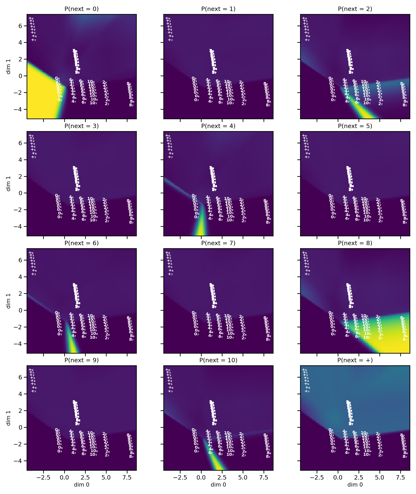
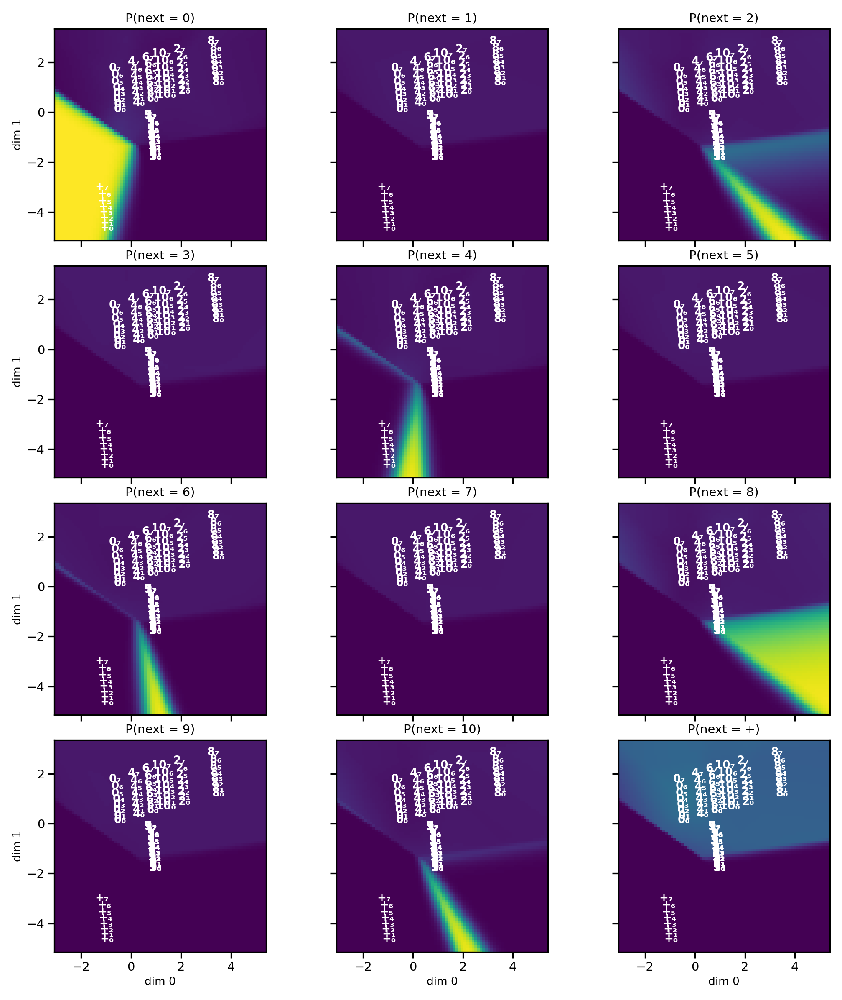
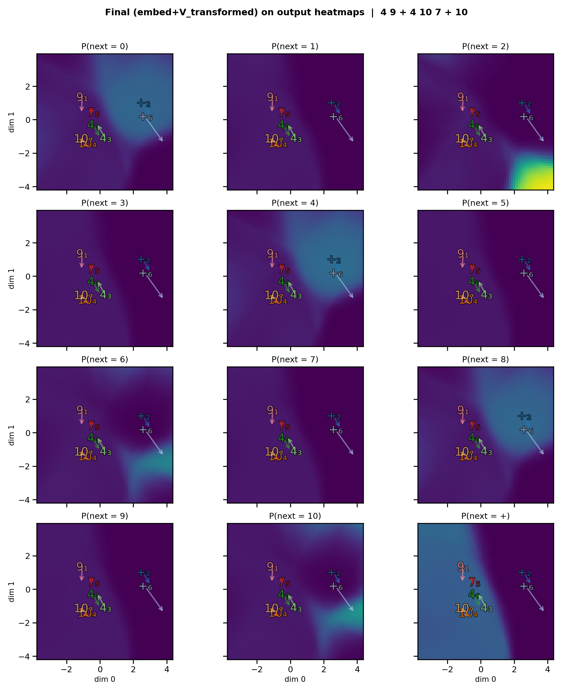

---
header-includes:
  - \usepackage{seqsplit}
  - \usepackage{tabularx}
---

# Fully Interpretable Minimal Transformers: From Geometry to Algorithm

Toviah Moldwin, Raneem Mahajne, and Idan Segev  
Edmond and Lily Safra Center for Brain Sciences, The Hebrew University of Jerusalem

> **Abstract.**
> We present a framework for building and interpreting minimal transformer language models trained on procedurally-generated integer sequences. By constraining the embedding dimension to $n_{\mathrm{embed}} = 2$ and the head size to $d_k = 2$, we enable full two-dimensional visualization of every internal representation — embeddings, query/key/value transforms, attention outputs, residual streams, and the language-model head's decision boundaries. Our central claim is that **the learned geometry implies an algorithm**: the arrangement of points and boundaries in $\mathbb{R}^2$ can be read as a step-by-step procedure. Using a simple task where the model must produce the most recent even number whenever it sees the '+' operator, we show how the model embeds the tokens and their respective positions in the sequence, transforms them via the Q, K, and V matrices, uses the dot product between the Q and K representations to form the attention matrix, and uses the attention matrix to select values that move the representation of each input token to the region of the domain of the LM head that will correctly predict the next token. We introduce a suite of interpretability visualizations that make the  algorithmic interpretation of this procedure explicit, and provide training-evolution animations showing how the algorithmic geometry emerges during learning. The framework offers a pedagogical and experimental testbed to explore how transformers use informational geometry to solve tasks.

---

## 1. Introduction

Understanding how transformers process sequences remains a central challenge in mechanistic interpretability. Large-scale models achieve strong performance but their internal representations are high-dimensional and opaque: one can probe attention or activations, but a complete picture of information flow from input to output is often difficult to obtain. 

We address this problem with **minimal transformers**: models that retain the full structure of a decoder-only transformer (token and positional embeddings, single-head causal self-attention, residual connections, a feedforward layer, and an LM head) but are constrained to two-dimensional embeddings and head dimension. Every internal state — embeddings, queries, keys, values, attention outputs, residual sums, and pre-softmax logit vectors — lives in $\mathbb{R}^2$. Dimentionality reduction techniques such as PCA, t-SNE, or UMAP are not required; the information geometry learned by the model is directly visible in the 2D plane.
We can take advantage of this direct visibility to demonstrate how the information geometry of the transformer can be straightforwardly interpreted as an algorithmic procedure. 

## 2. Methods

### 2.1 Task Definition

We adopt the plus-last-even rule as our primary task. This procedurally generated task isolates the core attention operations—conditional retrieval and recency—in a setting simple enough that all internal representations remain interpretable in $\mathbb{R}^2$.

#### 2.1.1 The Plus-Last-Even Task

The task is defined over a vocabulary $\mathcal{V}$ of 12 tokens: the integers $\{0, \ldots, 10\}$ and a special operator $+$. Sequence generation obeys:

- **Retrieval rule:** If $+$ occurs at position $t$, the output at $t+1$ must be the most recent even integer $x_i \in \{0, 2, 4, 6, 8, 10\}$ with $i < t$. (If there is no earlier even number, then any token can be chosen).
- **Unconstrained positions:** All positions not immediately following $+$ are unconstrained; any token in $\mathcal{V}$ may appear. These positions provide context that the model must process without applying the retrieval rule.


<!-- The primary demonstration task is the **plus-last-even** rule. Sequences are generated over a vocabulary of 12 tokens: the integers 0–10 and a special operator `+`.

**Rule.** Whenever `+` appears in the sequence, the *next* token must be the most recent even number that appeared before that `+`. -->


```
5  3  8  7  +  8  10  2  4  +  4  ...
            ↑                 ↑
       last even = 8     last even = 4
```

Positions not immediately following `+` are unconstrained — any token may appear. The rule constrains only a fraction of positions; the remainder serve as context. The model must learn to (1) identify when the current position follows `+`, (2) scan backward through the context to locate the most recent even number, and (3) output that number with high probability. This is a non-trivial attention task: it requires routing information from a variable, content-dependent past position to the present.


### 2.2 Model Architecture

The model is a single-layer, single-head, decoder-only causal transformer — the minimal instance of the architecture introduced by Radford et al. (GPT). It processes tokens autoregressively: at each position it conditions on the preceding tokens within a fixed context window of $T = 8$ and produces a distribution over the next token. The single transformer block contains one causal self-attention head and a feedforward network (a two-layer MLP applied independently to each position), with a residual connection around each sub-layer, followed by a linear language-model head that maps the final hidden state to vocabulary logits (Figure 1). Table 1 lists all hyperparameters.

\newpage

| Parameter | Value |
|-----------|-------|
| $n_{\mathrm{embed}}$ | 2 |
| Block size ($T$) | 8 |
| Number of heads | 1 |
| Head size ($d_k$) | 2 |
| Vocabulary size ($V$) | 12 (integers 0–10, operator +) |
| Feed-forward hidden size | $16 \times n_{\mathrm{embed}} = 32$ |

: Model hyperparameters. {#tbl:hyperparams}


**Token embedding:** $X \in \mathbb{R}^{V \times 2}$. At position $i$, the token has id $t_i$; we denote its **token embedding** (the row of $X$ for that token) by $\mathbf{x}_i \in \mathbb{R}^2$. **Positional embedding:** $P \in \mathbb{R}^{T \times 2}$; the embedding of position $i$ is $\mathbf{p}_i \in \mathbb{R}^2$. The **combined embedding** (input to attention) at position $i$ is
$$
\mathbf{e}_i = \mathbf{x}_i + \mathbf{p}_i.
$$


**Self-attention** computes queries $\mathbf{q}_i = W_Q \mathbf{e}_i$, keys $\mathbf{k}_i = W_K \mathbf{e}_i$, and values $\mathbf{v}_i = W_V \mathbf{e}_i$, with $W_Q, W_K, W_V \in \mathbb{R}^{2 \times 2}$. Attention weights at position $i$ (over $j \leq i$, causal mask) are:

$$
\boldsymbol{\alpha}_i = \mathrm{softmax}\left(\frac{\mathbf{q}_i^\top \mathbf{K}_{1:i}}{\sqrt{d_k}}\right),
$$
where $\mathbf{q}_i, \mathbf{k}_j \in \mathbb{R}^2$ (column vector of length 2), $\mathbf{K}_{1:i} = [\mathbf{k}_1 \, \cdots \, \mathbf{k}_i] \in \mathbb{R}^{2 \times i}$, so $\mathbf{q}_i^\top \mathbf{K}_{1:i}$ is a row vector of length $i$ (one score per $j \leq i$; causal masking is implicit in the index range).

The **attention output** at position $i$, denoted $\mathrm{Attn}(\mathbf{e})_i \in \mathbb{R}^2$, is the weighted sum of value vectors over previous positions:
$$
\mathrm{Attn}(\mathbf{e})_i = \sum_{j=1}^{i} \alpha_{ij} \mathbf{v}_j,
$$
where $\mathbf{v}_j = W_V \mathbf{e}_j$ and $\alpha_{ij}$ is the $(i,j)$ entry of the attention weights (from the softmax above). Thus $\mathrm{Attn}(\mathbf{e})_i$ is the "message" delivered to position $i$ by the attention mechanism.

**First residual.** The representation passed to the feedforward block is the sum of the combined embedding and the attention output. We denote this **first-residual state** by $\mathbf{z}_i$:
$$
\mathbf{z}_i = \mathbf{e}_i + \mathrm{Attn}(\mathbf{e})_i.
$$
So $\mathbf{z}_i$ is the quantity that is passed into the feedforward network (and is what the LM head ultimately receives after the second residual).

**Second residual.** The feedforward network (FFN) is applied to $\mathbf{z}_i$, and its output is added back to $\mathbf{z}_i$ (the second residual connection). The resulting **hidden state** passed to the LM head is
$$
\mathbf{h}_i = \mathbf{z}_i + \mathrm{FFN}(\mathbf{z}_i).
$$

**LM head.** The LM head produces the next-token distribution from the hidden state $\mathbf{h}_i$ (not $\mathbf{e}_i$):
$$
P(t_{i+1} \mid \mathbf{h}_i) = \mathrm{softmax}\!\left(\mathbf{h}_i \, W_{\mathrm{lm}}^\top + \mathbf{b}\right),
$$
where $W_{\mathrm{lm}} \in \mathbb{R}^{V \times 2}$ and $\mathbf{b} \in \mathbb{R}^V$.

The forward pass can be summarized as:

$$
\begin{aligned}
\mathbf{e}_i &= \mathbf{x}_i + \mathbf{p}_i, \\
\mathbf{z}_i &= \mathbf{e}_i + \mathrm{Attn}(\mathbf{e})_i, \\
\mathbf{h}_i &= \mathbf{z}_i + \mathrm{FFN}(\mathbf{z}_i), \\
P(t_{i+1} \mid \mathbf{h}_i) &= \mathrm{softmax}\!\left(\mathbf{h}_i \, W_{\mathrm{lm}}^\top + \mathbf{b}\right).
\end{aligned}
$$


\begin{center}
\pandocbounded{\includegraphics[keepaspectratio,alt={Architecture Overview}]{plus_last_even/plots/a4/01_architecture_overview.png}}
\end{center}
***Figure 1.** Architecture of the minimal transformer. Every component operates entirely in $\mathbb{R}^2$.*

---

### 2.3 Training

Training data consists of 2,000 sequences of length 20–50, generated by the plus-last-even rule. At each position, the next token is drawn as follows. With probability 0.3 the token is `+`; with probability 0.7 it is a digit chosen uniformly from $\{0, \ldots, 10\}$. The one exception is the position immediately after `+`: there the next token is fixed to the most recent even number in the prefix (the rule target). Thus in the training distribution, `+` has marginal probability 0.3, each digit has marginal probability $0.7 / 11 \approx 0.064$, and every position following `+` is a constrained label.

The model is optimized with AdamW ($\beta_1 = 0.9$, $\beta_2 = 0.999$, weight decay $10^{-2}$, PyTorch defaults) using standard next-token cross-entropy loss. Table 2 lists all training hyperparameters. Checkpoints are saved every 100 steps (200 total), enabling the construction of training-evolution animations.

| Parameter | Value |
|-----------|-------|
| Optimizer | AdamW |
| Learning rate | $10^{-3}$ |
| Batch size | 8 |
| Training steps | 20,000 |
| Evaluation interval | every 200 steps |
| Evaluation iterations | 50 batches |
| Checkpoint interval | every 100 steps |

: Training hyperparameters. {#tbl:training}

---

## 3. Results

The full computation graph of the minimal transformer is shown in Figure 1. Every component — token and position embeddings, the single-head attention block with its $W_Q$, $W_K$, $W_V$ projections, the causal mask, residual connections, feed-forward network, and LM head — operates entirely in $\mathbb{R}^2$, making it possible to visualize each stage of the pipeline without any dimensionality reduction.

\begin{center}
\pandocbounded{\includegraphics[keepaspectratio,alt={Architecture Overview}]{plus_last_even/plots/a4/01_architecture_overview.png}}
\end{center}
***Figure 1.** Architecture of the minimal transformer.*

### 3.1 The Model Learns the Rule

We first verify that training succeeds by examining the training data, the model's own generations, and the learning curve. Figure 2 displays four sample training sequences as heatmaps. **Color convention:** at each position we show whether the next-token label is correct (green), wrong (red), or unconstrained (gray). A position is *constrained* if it immediately follows `+` (the rule then requires the next token to be the most recent even number); *unconstrained* positions may have any next token. All constrained positions in the training data are green, verifying the data generator.


***Figure 2.** Sample training sequences as heatmaps. Green: constrained position (immediately after `+`) with the correct next token (the most recent even number). Gray: unconstrained position (any token is valid).*

Figure 3 shows the training dynamics over 20,000 steps. Cross-entropy loss drops steeply in the first ~2,000 steps, then continues to decrease more gradually. **Rule error** is the fraction of constrained positions (those immediately following `+`) where the model's top prediction is wrong; it drops from ~90% (chance for a 12-token vocabulary) to near 0%, indicating that the model has learned the rule.


***Figure 3.** Training dynamics over 20,000 steps. Left axis: cross-entropy loss. Right axis: rule error — the fraction of constrained positions (tokens immediately following `+`) where the model's top predicted token is not the target (the most recent even number). Rule error near 90% is chance level; near 0% indicates the rule is learned.*

Figure 4 compares sequences generated by the model before and after training. The same color convention applies: at initialization (step 0), predictions at constrained positions are essentially random — most cells are red. After training, nearly all constrained positions are green: the model reliably outputs the most recent even number after every `+`. We now proceed to show how the model implements this rule.


***Figure 4.** Model-generated sequences at initialization (top) vs. after training (bottom). green = correct at constrained positions (after `+`), red = wrong at constrained positions, gray = unconstrained. Top: at step 0, constrained positions are mostly red (random predictions). Bottom: after training, constrained positions are mostly green (correct "last even" outputs).*

### 3.2 The Embedding Space: How the Model Encodes Its Vocabulary

The first stage of the transformer maps each input token and position to a 2D vector. Figure 5 reveals that the learned embedding layer has already done significant organizational work before any attention occurs. In the token embedding scatter plot (Figure 5a), the six even numbers (0, 2, 4, 6, 8, 10) sit in a spaced formation at the top of the plane, the five odd numbers (1, 3, 5, 7, 9) bunch together in the center of the plane, and the `+` operator sits far from both groups as an isolated outlier. The model has discovered that the categories relevant to the rule — even numbers, odd numbers, and the operator — should occupy geometrically distinct regions. Moreover, the 'personal space' given to the even-digit tokens, as opposed to the bunched formation of the odd tokens, indicates that the distinct identity of the even tokens is more important for solving this task.

The position embeddings (Figure 5b) form a ladder structure, with $p_0$ at the bottom, $p_7$ at the top, and the other positions arranged in ascending order in between. This orderly arrangement allows the model to encode how far back a token is, which is essential for identifying the most recent even number. When token and position embeddings are summed (Figure 5g), each token fans out into eight copies — one per position — shifted vertically by the position embedding. Because the range of values of the position embeddings is smaller than the range of the token embeddings, the 'macro'-level geometry of the summed token+position embeddings retains the odd/even/'+' organization of the token embeddings, while the 'micro'-level geometry preserves the ladder structure of the position embeddings.


***Figure 5.** Learned embeddings. (a) Token embeddings. (b) Position embeddings. (c) Combined token+position embeddings.*

We emphasize that this geometric structure does not exist at initialization; it is learned. Movie 1 shows the embedding space at every checkpoint across training. At step 0, all points are randomly scattered. Within the first few thousand steps, the `+` token rapidly migrates away from the number tokens. The even/odd split solidifies between steps 5,000 and 10,000, and the position embedding ladder organizes gradually throughout training. 
### 3.3 The Attention Mechanism: Query, Key, and Value Projections

The combined embeddings $\mathbf{e}_i$ alone are not sufficient for the model to obey the plus-last-even rule, due to the rule's conditional structure: simply knowing the token value and its position is not enough to predict the next token. The '+' tokens need to "search back" for the most recent even number to generate the correct answer. This retrieval process is what motivates the use of the attention mechanism.

To illustrate how the attention mechanism works, consider what happens when the model encounters a `+` token and needs to retrieve the most recent even number. Each combined embedding $\mathbf{e}_i$ is linearly transformed into three vectors: a query ($q$), a key ($k$), and a value ($v$). For example, when processing $\mathbf{+}_{7}$ (the `+` token at position 7), the query vector represents the "search request" asking, "Where is the relevant even number?" Every other position in the sequence, including those with even numbers, supplies its own key and value vectors. The model computes the attention weights for the `+` token by taking the dot product between its query ($q$) and every other token's key ($k$). This produces a score indicating how strongly the `+` should attend to each past token—ideally, giving the highest score to the key corresponding to the most recent even number. The value vectors ($v$) determine what information can actually be retrieved—so the value for the most recent even number carries the identity of that number, which is then used to generate the correct output after `+`. In summary: the query and key machinery let the `+` "look back" specifically for even numbers (and, thanks to position information, for the most recent one), while the value machinery lets the model retrieve exactly which even number should be output.

The model applies three learned $2 \times 2$ linear transformations — $W_Q$, $W_K$, $W_V$ — to every combined embedding $\mathbf{e}_i$, producing query, key, and value vectors respectively. Figure 7 shows these transformations and their effect. Panel (a) displays the original combined token+position embeddings (all 96 points in embedding space). Panels (b), (c), and (d) show the same points after projection into query space (blue), key space (red), and value space (green).


***Figure 7.** QKV projections. (a) Original combined token+position embeddings. (b) Query-space (blue), with $W_Q$ inset. (c) Key-space (red), with $W_K$ inset. (d) Value-space (green), with $W_V$ inset. All 96 token+position points in each panel.*

### 3.4 Who Attends to Whom: The Query–Key Geometry

When the model encounters a `+`, how does it know to look back and find the most recent even number? The answer lies in the geometry of the query–key space. Figure 8 plots all 96 query vectors (blue) and all 96 key vectors (red) on common axes, so we can directly read off the attention pattern from the spatial relationships.

Figure 8 (Top) makes this geometry visible. The `+` queries form a tight single-file cluster well-separated from all number queries. Even-number keys are concentrated in the region closest to that `+` cluster, while odd-number keys lie in a distinctly different region, far from it. This spatial arrangement is the geometric encoding of the rule's core requirement: `+` should attend to even numbers and ignore odd numbers. 

But the rule demands more than just "attend to even numbers" — it requires attending to the *most recent* one. This is encoded in the positional spread of each token's keys. Within the key cluster for any given even number, keys at later positions (closer to the query) are arranged so that they are closer to the `+` queries than keys at earlier positions. 

If we focus on a single query $\mathbf{+}_5$ (`+` at position 5), we can see the dot product (green background) between that query and a key at any point in space (Figure 8 Bottom). In principle, the dot product is highest with even numbers at position 7, however, because of the causal masking, queries are only allowed to look at keys that come before it in the sequence, so we have greyed out all keys that come before position 5 (keys in positions 5 are also greyed out because if there's a plus in position 5, no other token could be in position 5). The `+` query thus acts as a selective filter that picks out even-number keys from the past context, with recency biasing the selection toward the most recent one.


***Figure 8.** Query–key geometry in Q/K space. **Top:** joint query–key space (blue: queries; red: keys; labels show token and position). **Bottom:** dot-product landscape for the query `+` at position 5; background color is $\mathbf{q}_{+_5}^\top \mathbf{k}$, and keys with position $\geq 5$ are grayed by the causal mask.*

Movie 4 reveals how this structure develops over the course of training. At initialization, queries and keys are intermingled with no meaningful separation. Over the first several thousand steps, the `+` queries begin migrating away from the number queries. Simultaneously, even number keys separate from odd-number keys along the axis that aligns with the `+` query direction. By the end of training, the geometry has converged to the configuration described above: a clear `+` query cluster aligned with even-number keys and orthogonal to odd-number keys.


The full 96×96 attention score matrix (Figure 9) confirms that this pattern generalizes across all token–position combinations. The matrix is organized as a 12×12 grid of blocks, where each block represents one query-token versus one key-token, with the 8 positions arranged within each block. The bottom row — corresponding to `+` as the query token — is the most informative: even-number key columns (0, 2, 4, 6, 8, 10) show warm colors (high attention scores), while odd-number key columns show cool colors (low scores). The `+` operator attends selectively and strongly to even numbers, regardless of position. Movie 5 shows this row sharpening from a diffuse pattern at initialization to the clean even/odd dichotomy observed in the final model.


***Figure 9.** Full 96×96 attention score matrix, organized as a 12×12 grid of token–token blocks.*

For the sequence `10 + 10 6 + 6 4 8` (traced in full in §3.7 below), Figure 10 shows the dot-product gradient for each query position. Each panel visualizes that query's dor product with all keys across the Q/K plane, along with the masked $Q \cdot K^\top$ scores and the resulting attention weights. This makes the retrieval pattern explicit per position (e.g. Both `+` queries attend strongly to even-number keys).


***Figure 10.** Dot-product gradients for each query in the demo sequence, with masked $Q \cdot K^\top$ and attention heatmaps.*

### 3.5 What Gets Retrieved: The Value Space

The Q/K geometry determines *where* the model looks; the value transformation determines *what information* it extracts. Figure 11 overlays the value-transformed vectors ($W_V \mathbf{e}_j$ applied to each combined embedding) on the same probability heatmaps from Figure 6. The key observation is that the value vectors for each even number are positioned so that, after being selected by attention and summed, the resulting vector lands in the high-probability region for that even number in the output landscape. The model has learned a value transformation that is *coordinated* with the LM head's decision boundaries: V carries information in a form that the output layer can directly decode.


***Figure 11.** Output probability landscape with value-transformed vectors (all 96 token+position value vectors overlaid; cf. Figure 6, which shows raw embeddings).*

### 3.6 The Output Landscape: Where Representations Need to Land

Before examining the attention mechanism, we note that the combined token+position embeddings $\mathbf{e}_i$ is fed forward (via attention and residuals) to the feedforward network and LM head. It can thus be useful to understand how the geometry of the token+position embeddings $\mathbf{e}_i$ relates to the input-output function determined by the output network.

The output network (FFN, second residual, and LM head, as defined in §2.2) maps a point $\mathbf{z}_i \in \mathbb{R}^2$ to a probability distribution over the vocabulary: $\mathbf{z}_i \mapsto \mathrm{softmax}\!\bigl(\mathrm{LMHead}(\mathbf{z}_i + \mathrm{FFN}(\mathbf{z}_i))\bigr) \in \mathbb{R}^{12}$. Geometrically, this means that for each possible next token (the digits from 0 to 10 and the '+' operator), the 2D plane is partitioned into regions with different probabilities for predicting that token. (Because of the softmax, the probabilities across all tokens for a particular point in the 2D plane must sum to 1.) Figure 6 makes this partition explicit: each subplot shows the model's probability for a specific output token across the plane (yellow $\approx$ 1, purple $\approx$ 0).

Recall that the true input to the output network is the first-residual state $\mathbf{z}_i = \mathbf{e}_i + \mathrm{Attn}(\mathbf{e})_i$, which depends on the attention mechanism — a component we have not yet analyzed. To build intuition for the output landscape *before* introducing attention, we overlay the 96 combined embeddings $\mathbf{e}_i$ (token $\mathbf{x}_i$ + position $\mathbf{p}_i$, 12 tokens $\times$ 8 positions) on Figure 6 instead. These embeddings represent each token's *starting position* in the plane — the point from which attention will later shift the representation. Comparing where the $\mathbf{e}_i$ sit relative to the output network's decision regions reveals what the attention mechanism must accomplish: it must move each $\mathbf{e}_i$ to the region where the correct next token has high probability.

To understand how the model translates its internal 2D represenations ($\{e_i\}$) into discrete token predictions, we analyze the geometry of the output landscape.
We observe a clear functional decomposition of the plane into different regions: 
1. The indifference region (Large region in the upper half of the 2D plane for all units): The upper half-plane acts as a "default" zone where no single digit is strongly favored. Notably, the heatmap for the `+` operator unit shows the highest probability here. This reflects the training data: since the `+` token appears frequently (30%) and can follow almost any digit, the model learns to assign it a high baseline probability in this unspecialized area.
2. The strong specific prediction region (Large region in the bottom half of the 2D plane for all units). The lower half-plane is divided into distinct target zones for each even integer. In each of these zones, most units have very low output probabilities with the exception of a single even number which has very high output probability. This region of the 2D space is thus effectively reserved by the model for the final retrieval of the correct even digit after the `+` sign.

By overlaying all possible input-position embeddings $\{e_i\}$ (96 total embeddings, 12 tokens * 8 positions) onto these heatmaps, we can visualize how the model positions the embeddings with respect to the 2D landscape of the output network before the attention mechanism is applied. We observe a clear spatial structure with respect to how different embeddings are situated in this space:

• All embeddings for the digits $\{0, \dots, 10\}$ are located in the upper half-plane. By landing in this "neutral" zone, these tokens do not trigger a specific retrieval; instead, they maintain a high-entropy state where any subsequent digit or operator remains a valid prediction.

`+` input embeddings are located in the lower half-plane, which effectively provides a geometric headstart for the algorithm. By landing in this lower region, the model has already categorized the `+` token as requiring an even number output based on its identity and position. However, because the residual connection lacks the historical context of the sequence, it can identify the type of output needed but cannot resolve the specific value. This visualization thus defines the attention layer's objective as a corrective translation: the attention head must look back to find the most recent even number and produce a vector that, when added to the residual stream, nudges the representation into the specific region of the correct even integer target.


**Figure 6.**  Output probability landscape and functional geometry. Each subplot shows the softmax probability $P(\text{next} = \text{token})$ over the 2D embedding plane for a specific output token prediction (digits 0–10 and the `+` operator). 
Color intensity represents the softmax probability (yellow $\approx 1$, purple $\approx 0$). Note the "indifference region" at the top of the heatmap for each unit (where no unit has a particularly strong activation other than the '+' unit which is slightly stronger than the others) and the "strong specific prediction region" in the lower half of the heatmap for each unit, where each even number has its own high-probability zone (yellow bands). White labels mark the locations of all 96 combined embeddings $\mathbf{e}_i$.
Observe that the integer embeddings fall in the "indifference region" while the '+' embeddings fall in the "strong specific prediction region".

The output landscape and the embedding positions co-evolve during training (Movie 2). At initialization, the probability landscape is nearly uniform — no decision boundaries exist. As the model first learns token frequencies, broad regions form. These sharpen progressively into the final configuration where each even number has a well-defined, non-overlapping high-probability region.

### 3.7 Tracing a Sequence Through the Pipeline

The preceding analysis characterized the model's learned parameters in the abstract — all 96 possible token+position combinations. We now ground this analysis by tracing a single concrete sequence, `10 + 10 6 + 6 4 8`, through the complete inference pipeline and verifying that each step works as predicted.

**Embedding.** Figure 12 shows where each token in this specific sequence lands in embedding space. The `+` tokens at positions 1 and 4 are located far from the number tokens, exactly as the global structure predicts. The number tokens fan out according to their position offsets, with even numbers (10, 6, 4, 8) and odd numbers in their respective global clusters. This sequence contains two constrained positions: position 2 (which follows the first `+`, with the last even being 10) and position 5 (which follows the second `+`, with the last even being 6).


***Figure 12.** Embeddings for the demo sequence `10 + 10 6 + 6 4 8`, shown as heatmaps (top) and 2D scatter (bottom).*

**Attention.** Figure 13 displays the full attention computation for this sequence. The Q/K scatter (panel 3) shows the sequence's query and key vectors against the global backdrop — the `+` queries at positions 1 and 4 are visibly isolated in the region that aligns with even-number keys. The raw attention scores (panel 4, before softmax) show high values where `+` queries meet keys from positions containing even numbers, and the final attention matrix (panel 5, after softmax) confirms the expected pattern. At position 2 (the token after the first `+`), the model attends overwhelmingly to position 0, which contains 10 — the most recent even number before that `+`. At position 5 (the token after the second `+`), the model attends most strongly to position 3, which contains 6 — the most recent even number before the second `+`. The retrieval mechanism identified in the global analysis (Figures 8–10) is operating exactly as predicted on real inputs.


***Figure 13.** Attention computation for the demo sequence. Panels: Q heatmap, K heatmap, Q/K scatter, raw scores, attention weights.*

**Value routing.** Figure 14 completes the attention story by showing what information is actually extracted. The attention-weighted sum of value vectors at each position (panel 3) represents the "message" that attention delivers to the residual stream. At the two constrained positions, the attention output is dominated by the value vector of the attended even number — token 10 and token 6, respectively. The attention-output scatter (panel 5) shows where these messages land in 2D space: they point toward the regions where the output landscape (Figure 6) assigns high probability to the correct answer.


***Figure 14.** Value pathway for the demo sequence. Panels: attention weights, V vectors, attention output, V scatter, output scatter.*

**Residual stream.** The attention output $\mathrm{Attn}(\mathbf{e})_i$ does not replace the combined embedding $\mathbf{e}_i$ — it is added to it via the first residual to form $\mathbf{z}_i = \mathbf{e}_i + \mathrm{Attn}(\mathbf{e})_i$. Figure 15 visualizes this addition. The bottom row shows, in 2D, the combined embedding $\mathbf{e}_i$ at each position, the attention output $\mathrm{Attn}(\mathbf{e})_i$, and arrows illustrating how the residual sum yields $\mathbf{z}_i$. The critical observation is in the arrow plot (panel c): at the two `+` positions, the arrows are large and point decisively toward the region of the plane associated with the correct even number. The attention mechanism is literally *moving* the `+` representation from its starting location $\mathbf{e}_i$ in the operator cluster to $\mathbf{z}_i$, which (after the second residual) will lie in the decision region for the correct output token. At unconstrained positions — where the model does not need to implement the rule — the arrows are smaller and less directed, leaving those representations relatively undisturbed.


***Figure 15.** Residual stream for the demo sequence. Bottom row: combined embeddings $\mathbf{e}_i$ (a), attention output $\mathrm{Attn}(\mathbf{e})_i$ (b), residual shift arrows $\mathbf{e}_i \to \mathbf{z}_i$ (c), and first-residual states $\mathbf{z}_i$ (d).*

**Output verification.** Finally, Figure 16 provides the empirical proof that the full pipeline works. Each subplot overlays the first-residual states $\mathbf{z}_i$ (embedding + attention output) on the output probability heatmaps from Figure 6; the heatmap gives $P(\text{next token})$ as a function of the 2D point that is passed through the second residual and LM head (i.e. as a function of the pre–LM-head input). At every constrained position, $\mathbf{z}_i$ — after the second residual yields $\mathbf{h}_i = \mathbf{z}_i + \mathrm{FFN}(\mathbf{z}_i)$ and the LM head maps $\mathbf{h}_i$ to logits — sits squarely inside the high-probability region for the correct even number. The `+` at position 1 has been moved into the region where $P(\text{next} = 10)$ is maximal. The `+` at position 4 has been moved into the region where $P(\text{next} = 6)$ is maximal. The geometry has executed the algorithm: detect `+`, retrieve the most recent even number, add its value to form $\mathbf{z}_i$, and land in the correct output region.


***Figure 16.** First-residual states $\mathbf{z}_i$ (embedding + attention output) overlaid on the output probability landscape. Each $\mathbf{z}_i$ is the input to the second residual and FFN; the LM head then maps $\mathbf{h}_i = \mathbf{z}_i + \mathrm{FFN}(\mathbf{z}_i)$ to the prediction. Each `+` position lands in the high-probability region for the correct even number.*

---

## 4. Geometry as Algorithm: Summary

For the plus-last-even rule, the model's behavior decomposes into a five-step algorithm. Each step corresponds to a specific geometric structure visible in the preceding figures.

1. **Encode.** Map each (token, position) pair to a 2D point: token embedding $\mathbf{x}_i$ plus position embedding $\mathbf{p}_i$ gives the combined embedding $\mathbf{e}_i = \mathbf{x}_i + \mathbf{p}_i$. The embedding scatter plots (Figure 5) show this mapping, with even numbers, odd numbers, and `+` occupying distinct regions.

2. **Detect the operator.** The query projection $W_Q$ maps the `+` embedding to a query vector that is geometrically distinct from number queries. The Q/K embedding space (Figure 8, top) shows `+` queries forming a separate cluster.

3. **Retrieve the last even number.** The dot product between the `+` query and all keys yields high attention weight for even-number keys, with recency encoded in the positional component of the key layout. The focused-query analysis (Figure 8, bottom) and full attention matrix (Figure 9) make this retrieval pattern explicit; the per-query gradient figure (Figure 10) shows it for the demo sequence.

4. **Route value through first residual.** Attention selects the value vector at the most recent even-number position; the first residual adds it to the combined embedding: $\mathbf{z}_i = \mathbf{e}_i + \mathrm{Attn}(\mathbf{e})_i$. The residual stream visualization (Figure 15) shows the `+` position's representation being displaced from $\mathbf{e}_i$ to $\mathbf{z}_i$ toward the correct even number's region.

5. **Output.** The second residual forms $\mathbf{h}_i = \mathbf{z}_i + \mathrm{FFN}(\mathbf{z}_i)$. The LM head partitions $\mathbb{R}^2$ into decision regions, one per token, and maps $\mathbf{h}_i$ to logits; softmax produces the prediction. The output probability heatmaps (Figure 6) and the overlay of $\mathbf{z}_i$ on that landscape (Figure 16) confirm that each $\mathbf{z}_i$ lies in the region corresponding to the correct even number.

The geometry *is* the algorithm. There is no separate procedure hidden in the weights; the 2D arrangement of points and decision boundaries is itself the step-by-step computation the model executes.

---

## 5. Discussion

**Why two dimensions?** Constraining $n_{\mathrm{embed}} = 2$ and $d_k = 2$ sacrifices expressiveness for complete interpretability. The model must implement the rule in a low-dimensional space, which forces it to discover a compact solution. Every state and every boundary is directly visible without projection artifacts. For many procedural rules (copy-modulo, successor, plus-last-even), two dimensions suffice for high accuracy. For harder tasks, the framework could be extended to $n_{\mathrm{embed}} = 4$ or higher, using paired 2D projections to retain partial interpretability.

**Limitations.** (1) The rules are synthetic and the vocabulary is small; transfer to natural-language tasks or more complex reasoning remains an open question. (2) We use a single head and a single block; deeper or wider models would require dimensionality reduction or other tools. (3) Some rules may require more than two dimensions to learn efficiently; we have not systematically tested the minimal sufficient dimensionality. (4) The algorithmic reading is a qualitative interpretation of the geometry; we do not provide a formal proof that the model "implements" this algorithm, though the figures constitute strong evidence.

**Future directions.** Natural extensions include automating the geometry-to-algorithm description (e.g., by programmatically summarizing attention patterns and decision boundaries), comparing the learned geometry across different rules to identify common algorithmic motifs, and testing whether targeted interventions in embedding space (e.g., ablating a direction) produce the predicted behavioral change — thereby establishing that the geometry is causally related to the algorithm.

---

## 6. Movies

The following animations show the evolution of the model's learned geometry over the course of training (one frame per checkpoint, 200 frames total). These are available as GIF/MP4 files in `plus_last_even/plots/learning_dynamics/`.

\noindent
\begin{tabularx}{\linewidth}{@{}l>{\raggedright\arraybackslash}p{3.5cm}>{\raggedright\arraybackslash}X@{}}
\toprule
Movie & \texttt{File} & Description \\
\midrule
Movie 1 & \parbox[t]{3.5cm}{\raggedright\ttfamily\seqsplit{01\_embeddings\_scatterplots.gif}} & Evolution of token, position, and combined embedding scatter plots. The \texttt{+} token separates from numbers first; the even/odd split solidifies by step 5,000--10,000. \\
Movie 2 & \parbox[t]{3.5cm}{\raggedright\ttfamily\seqsplit{05\_output\_heatmaps\_with\_embeddings.gif}} & Co-evolution of the LM head's output probability landscape and embedding positions. Decision boundaries sharpen progressively from a uniform initialization. \\
Movie 3 & \parbox[t]{3.5cm}{\raggedright\ttfamily\seqsplit{02\_embedding\_qkv\_comprehensive.gif}} & Specialization of the Q, K, and V subspaces. All three projections are initially identical and develop distinct geometry as training progresses. \\
Movie 4 & \parbox[t]{3.5cm}{\raggedright\ttfamily\seqsplit{03\_qk\_embedding\_space.gif}} & Separation of query and key subspaces. \texttt{+} queries migrate away from number queries; even-number keys align with the \texttt{+} query direction. \\
Movie 5 & \parbox[t]{3.5cm}{\raggedright\ttfamily\seqsplit{04\_qk\_space\_plus\_attention.gif}} & Evolution of the full attention matrix alongside the Q/K scatter. The \texttt{+}-row entries concentrate on even-number columns over training. \\
\bottomrule
\end{tabularx}

### Supplementary Figures

Additional static figures in `plus_last_even/plots/supplementary/` and `plus_last_even/plots/extended/`:

\noindent
\begin{tabularx}{\linewidth}{@{}>{\raggedright\arraybackslash}p{3.2cm}>{\raggedright\arraybackslash}X@{}}
\toprule
\texttt{File} & Description \\
\midrule
\parbox[t]{3.2cm}{\raggedright\ttfamily\seqsplit{supplementary/07\_qkv\_overview.png}} & Comprehensive 3$\times$3 panel: token, position, and combined embeddings; Q/K/V transformed spaces; Q+K overlay; and attention output. \\
\parbox[t]{3.2cm}{\raggedright\ttfamily\seqsplit{supplementary/14\_attention\_matrix.png}} & Per-sequence attention matrices alongside LM head linear input, logits, and output probabilities for three demo sequences. \\
\parbox[t]{3.2cm}{\raggedright\ttfamily\seqsplit{supplementary/16\_value\_arrows.png}} & Value vectors (original, transformed, residual) for three demo sequences, with correctness indicated by green/red markers. \\
\parbox[t]{3.2cm}{\raggedright\ttfamily\seqsplit{extended/08\_qkv\_transforms\_extended.png}} & Extended QKV figure with per-dimension heatmaps (tokens$\times$positions) for Q, K, and V. \\
\bottomrule
\end{tabularx}

---

## 7. Reproducing the Results

**Train and visualize:**
```bash
python main.py plus_last_even
```

**Visualize from an existing checkpoint:**
```bash
python main.py plus_last_even --visualize
```

**Visualize a specific training step:**
```bash
python main.py plus_last_even --visualize --step 5000
```

**Generate learning-dynamics videos:**
```bash
python main.py plus_last_even --video
python main.py plus_last_even --video-qkv
```

**Dependencies:** PyTorch, NumPy, Matplotlib, Pillow, imageio.

---

## References

- Bhattamishra, S., Ahuja, K., & Goyal, N. (2020). On the computational power of transformers and its implications in sequence modeling. *CoRR*, abs/2006.09286.
- Clark, K., Khandelwal, U., Levy, O., & Manning, C. D. (2019). What does BERT look at? An analysis of BERT's attention. *ACL Workshop on BlackboxNLP*.
- Hewitt, J. & Liang, P. (2019). Designing and interpreting probes with control tasks. *EMNLP*.
- Mikolov, T., Sutskever, I., Chen, K., Corrado, G. S., & Dean, J. (2013). Distributed representations of words and phrases and their compositionality. *NeurIPS*.
- Olsson, C., Elhage, N., Nanda, N., et al. (2022). In-context learning and induction heads. *Transformer Circuits Thread*.
- van der Maaten, L. & Hinton, G. (2008). Visualizing data using t-SNE. *JMLR*, 9, 2579–2605.
- Vig, J. (2019). A multiscale visualization of attention in the transformer model. *ACL System Demonstrations*.
- Wang, K., Variengien, A., Conmy, A., Shlegeris, B., & Steinhardt, J. (2022). Interpretability in the wild: A circuit for indirect object identification in GPT-2 small. *NeurIPS*.
- Weiss, G., Goldberg, Y., & Yahav, E. (2018). On the practical computational power of finite precision RNNs for language recognition. *ACL*.
