---
header-includes:
  - \usepackage{seqsplit}
  - \usepackage{tabularx}
---

# Fully Interpretable Minimal Transformers: From Geometry to Algorithm

Toviah Moldwin, Raneem Mahajne, and Idan Segev  
Edmond and Lily Safra Center for Brain Sciences, The Hebrew University of Jerusalem

> **Abstract.**
> We present a framework for building and interpreting minimal transformer language models trained on procedurally-generated integer sequences. By constraining the embedding dimension to $n_{\mathrm{embed}} = 2$ and the head size to $d_k = 2$, we enable full two-dimensional visualization of every internal representation — embeddings, query/key/value transforms, attention outputs, residual streams, and the language-model head's decision boundaries. Our central claim is that **the learned geometry implies an algorithm**: the arrangement of points and boundaries in $\mathbb{R}^2$ can be read as a step-by-step procedure. Using a simple task where the model must produce the most recent even number whenever it sees the '+' operator, we show how the model embeds the tokens and their respective positions in the sequence, transforms them via the Q, K, and V matrices, uses the dot product between the Q and K representations to form the attention matrix, and uses the attention matrix to select values that move the representation of each input token to the region of the domain of the LM head that will correctly predict the next token. We introduce a suite of interpretability visualizations that make the  algorithmic interpretation of this procedure explicit, and provide training-evolution animations showing how the algorithmic geometry emerges during learning. The framework offers a pedagogical and experimental testbed to explore how transformers (Vaswani et al., 2017) use informational geometry to solve tasks.

---

## 1. Introduction

Understanding how transformers process sequences (Vaswani et al., 2017) remains a central challenge in mechanistic interpretability. Large-scale models achieve strong performance but their internal representations are high-dimensional and opaque: one can probe attention or activations, but a complete picture of information flow from input to output is often difficult to obtain. 

We address this problem with **minimal transformers**: models that retain the full structure of a decoder-only transformer (token and positional embeddings, single-head causal self-attention, residual connections, a feedforward layer, and an LM head) but are constrained to two-dimensional embeddings and head dimension. Every internal state — embeddings, queries, keys, values, attention outputs, residual sums, and pre-softmax logit vectors — lives in $\mathbb{R}^2$. Dimentionality reduction techniques such as PCA, t-SNE (van der Maaten & Hinton, 2008), or UMAP are not required; the information geometry learned by the model is directly visible in the 2D plane.
We can take advantage of this direct visibility to demonstrate how the information geometry of the transformer can be straightforwardly interpreted as an algorithmic procedure. 

### 1.1 Related work

Much of the work in the mechanistic interpretability literature focuses on large language models and tries to interpret the attention matrices in terms of their linguistic properties they seem to represent (Vaswani et al., 2017; Clark et al., 2019; Vig, 2019; Wang, 2022; Liu, 2022). However, this work generally does not elucidate the full internal computational processing of the transformer, as we do here.

Other work on small models with 2-dimensional embeddings has analyzed how geometric structure in embedding space emerges during training on modular arithmetic (Musat, 2024). Complementary mechanistic work reverse-engineers the algorithm and training dynamics of grokking on modular addition in small transformers (Nanda et al., 2023); Welch Labs (2025) gives a visual overview aimed at a broad audience.

## 2. Methods

### 2.1 Task Definition

We adopt the plus-last-even rule as our primary task. This procedurally generated task isolates the core attention operations—conditional retrieval and recency—in a setting simple enough that all internal representations remain interpretable in $\mathbb{R}^2$.

#### 2.1.1 The Plus-Last-Even Task

The task is defined over a vocabulary $\mathcal{V}$ of 12 tokens: the integers $\{0, \ldots, 10\}$ and a special operator $+$. Sequence generation obeys:

- **Retrieval rule:** If $+$ occurs at position $t$, the output at $t+1$ must be the most recent even integer $x_i \in \{0, 2, 4, 6, 8, 10\}$ with $i < t$. (If there is no earlier even number, then any token can be chosen).
- **Unconstrained positions:** All positions not immediately following $+$ are unconstrained; any token in $\mathcal{V}$ may appear. These positions provide context that the model must process without applying the retrieval rule.


<!-- The primary demonstration task is the **plus-last-even** rule. Sequences are generated over a vocabulary of 12 tokens: the integers 0–10 and a special operator `+`.

**Rule.** Whenever `+` appears in the sequence, the *next* token must be the most recent even number that appeared before that `+`. -->


```
5  3  8  7  +  8  10  2  4  +  4  ...
            ↑                 ↑
       last even = 8     last even = 4
```

Positions not immediately following `+` are unconstrained — any token may appear. The rule constrains only a fraction of positions; the remainder serve as context. The model must learn to (1) identify when the current position follows `+`, (2) scan backward through the context to locate the most recent even number, and (3) output that number with high probability. This is a non-trivial attention task: it requires routing information from a variable, content-dependent past position to the present.


### 2.2 Model Architecture

The model is a single-layer, single-head, decoder-only causal transformer — the minimal instance of the GPT-style architecture of Radford et al. (2018), using scaled dot-product self-attention as in Vaswani et al. (2017). It processes tokens autoregressively: at each position it conditions on the preceding tokens within a fixed context window of $T = 8$ and produces a distribution over the next token. The single transformer block contains one causal self-attention head and a feedforward network (a two-layer MLP applied independently to each position), with a residual connection around each sub-layer, followed by a linear language-model head that maps the final hidden state to vocabulary logits (Figure 1). Table 1 lists all hyperparameters.

\newpage

| Parameter | Value |
|-----------|-------|
| $n_{\mathrm{embed}}$ | 2 |
| Block size ($T$) | 8 |
| Number of heads | 1 |
| Head size ($d_k$) | 2 |
| Vocabulary size ($V$) | 12 (integers 0–10, operator +) |
| Feed-forward hidden size | $16 \times n_{\mathrm{embed}} = 32$ |

: Model hyperparameters. {#tbl:hyperparams}


**Token embedding:** $X \in \mathbb{R}^{V \times 2}$. At position $i$, the token has id $t_i$; we denote its **token embedding** (the row of $X$ for that token) by $\mathbf{x}_i \in \mathbb{R}^2$. **Positional embedding:** $P \in \mathbb{R}^{T \times 2}$; the embedding of position $i$ is $\mathbf{p}_i \in \mathbb{R}^2$. The **combined embedding** (input to attention) at position $i$ is
$$
\mathbf{e}_i = \mathbf{x}_i + \mathbf{p}_i.
$$


**Self-attention.** Following Vaswani et al. (2017), let $\mathbf{E} \in \mathbb{R}^{T \times n_{\mathrm{embed}}}$ stack the combined embeddings with **row** $i$ equal to $\mathbf{e}_i^\top$. Learned projections $W_Q, W_K, W_V \in \mathbb{R}^{d_k \times n_{\mathrm{embed}}}$ map each position into head space (here $d_k = n_{\mathrm{embed}} = 2$). Per position, query, key, and value **column** vectors are $\mathbf{q}_i = W_Q \mathbf{e}_i$, $\mathbf{k}_i = W_K \mathbf{e}_i$, and $\mathbf{v}_i = W_V \mathbf{e}_i$ in $\mathbb{R}^{d_k}$. Stacking them as **rows** gives
$$
\mathbf{Q} = \mathbf{E} W_Q^\top, \quad \mathbf{K} = \mathbf{E} W_K^\top, \quad \mathbf{V} = \mathbf{E} W_V^\top,
$$
each in $\mathbb{R}^{T \times d_k}$ (sequence length $\times$ head size): row $i$ of $\mathbf{Q}$, $\mathbf{K}$, and $\mathbf{V}$ is $\mathbf{q}_i^\top$, $\mathbf{k}_i^\top$, and $\mathbf{v}_i^\top$, respectively.

Pre-softmax scores are $\mathbf{S} = \mathbf{Q} \mathbf{K}^\top / \sqrt{d_k} \in \mathbb{R}^{T \times T}$, with $S_{ij} = \mathbf{q}_i^\top \mathbf{k}_j / \sqrt{d_k}$. The attention matrix $A \in \mathbb{R}^{T \times T}$ is row-wise causal: for each $i$, $(A_{i1},\ldots,A_{ii}) = \mathrm{softmax}\bigl((S_{i1},\ldots,S_{ii})\bigr)$ and $A_{ij} = 0$ for $j > i$. Row $i$ of $A$ is denoted $\boldsymbol{\alpha}_i$ (so $\alpha_{ij} = A_{ij}$).

The **attention output** at position $i$, denoted $\mathrm{Attn}(\mathbf{e})_i \in \mathbb{R}^{d_k}$, combines value rows with $A$. The product $A \mathbf{V} \in \mathbb{R}^{T \times d_k}$ stacks outputs as rows: with $\boldsymbol{\alpha}_i$ the $i$-th row of $A$,
$$
\mathrm{Attn}(\mathbf{e})_i^\top = (A \mathbf{V})_{i,:} = \boldsymbol{\alpha}_i \mathbf{V}.
$$
Equivalently, with $\alpha_{ij} = A_{ij}$,
$$
\mathrm{Attn}(\mathbf{e})_i = \sum_{j=1}^{i} \alpha_{ij} \mathbf{v}_j.
$$
Thus $\mathrm{Attn}(\mathbf{e})_i$ is the "message" delivered to position $i$ by the attention mechanism.

**First residual.** The representation passed to the feedforward block is the sum of the combined embedding and the attention output. We denote this **first-residual state** by $\mathbf{z}_i$:
$$
\mathbf{z}_i = \mathbf{e}_i + \mathrm{Attn}(\mathbf{e})_i.
$$
So $\mathbf{z}_i$ is the quantity that is passed into the feedforward network (and is what the LM head ultimately receives after the second residual).

**Second residual.** The feedforward network (FFN) is applied to $\mathbf{z}_i$, and its output is added back to $\mathbf{z}_i$ (the second residual connection). The resulting **hidden state** passed to the LM head is
$$
\mathbf{h}_i = \mathbf{z}_i + \mathrm{FFN}(\mathbf{z}_i).
$$

**LM head.** The LM head produces the next-token distribution from the hidden state $\mathbf{h}_i$ (not $\mathbf{e}_i$):
$$
P(t_{i+1} \mid \mathbf{h}_i) = \mathrm{softmax}\!\left(\mathbf{h}_i \, W_{\mathrm{lm}}^\top + \mathbf{b}\right),
$$
where $W_{\mathrm{lm}} \in \mathbb{R}^{V \times 2}$ and $\mathbf{b} \in \mathbb{R}^V$.

The forward pass can be summarized as:

$$
\begin{aligned}
\mathbf{e}_i &= \mathbf{x}_i + \mathbf{p}_i, \\
\mathbf{z}_i &= \mathbf{e}_i + \mathrm{Attn}(\mathbf{e})_i, \\
\mathbf{h}_i &= \mathbf{z}_i + \mathrm{FFN}(\mathbf{z}_i), \\
P(t_{i+1} \mid \mathbf{h}_i) &= \mathrm{softmax}\!\left(\mathbf{h}_i \, W_{\mathrm{lm}}^\top + \mathbf{b}\right).
\end{aligned}
$$


\begin{center}
\pandocbounded{\includegraphics[keepaspectratio,alt={Architecture Overview}]{plus_last_even/plots/a4/01_architecture_overview.png}}
\end{center}
***Figure 1.** Architecture of the minimal transformer. Every component operates entirely in $\mathbb{R}^2$.*

---

### 2.3 Training

Training data consists of 2,000 sequences of length 20–50, generated by the plus-last-even rule. At each position, the next token is drawn as follows. With probability 0.3 the token is `+`; with probability 0.7 it is a digit chosen uniformly from $\{0, \ldots, 10\}$. The one exception is the position immediately after `+`: there the next token is fixed to the most recent even number in the prefix (the rule target). Thus in the training distribution, `+` has marginal probability 0.3, each digit has marginal probability $0.7 / 11 \approx 0.064$, and every position following `+` is a constrained label.

The model is optimized with AdamW ($\beta_1 = 0.9$, $\beta_2 = 0.999$, weight decay $10^{-2}$, PyTorch defaults) using standard next-token cross-entropy loss. Table 2 lists all training hyperparameters. Checkpoints are saved every 100 steps (200 total), enabling the construction of training-evolution animations. In our setup, a full run of 20,000 steps took on the order of 10--15 minutes on a laptop CPU (no GPU).

| Parameter | Value |
|-----------|-------|
| Optimizer | AdamW |
| Learning rate | $10^{-3}$ |
| Batch size | 8 |
| Training steps | 20,000 |
| Evaluation interval | every 200 steps |
| Evaluation iterations | 50 batches |
| Checkpoint interval | every 100 steps |

: Training hyperparameters. {#tbl:training}

---

## 3. Results

The full computation graph of the minimal transformer is shown in Figure 1 (Section 2.2). Every component — token and position embeddings, the single-head attention block (Vaswani et al., 2017) with its $W_Q$, $W_K$, $W_V$ projections (yielding $\mathbf{Q}, \mathbf{K}, \mathbf{V} \in \mathbb{R}^{T \times d_k}$ for the context), the causal mask, residual connections, feed-forward network, and LM head — operates with per-position vectors in $\mathbb{R}^{n_{\mathrm{embed}}} = \mathbb{R}^{d_k} = \mathbb{R}^2$, making it possible to visualize each stage of the pipeline without any dimensionality reduction.

### 3.1 The Model Learns the Rule

We first verify that training succeeds by examining the training data, the model's own generations, and the learning curve. Figure 2 displays four sample training sequences as heatmaps. **Color convention:** at each position we show whether the next-token label is correct (green), wrong (red), or unconstrained (gray). A position is *constrained* if it immediately follows `+` (the rule then requires the next token to be the most recent even number); *unconstrained* positions may have any next token. All constrained positions in the training data are green, verifying the data generator.

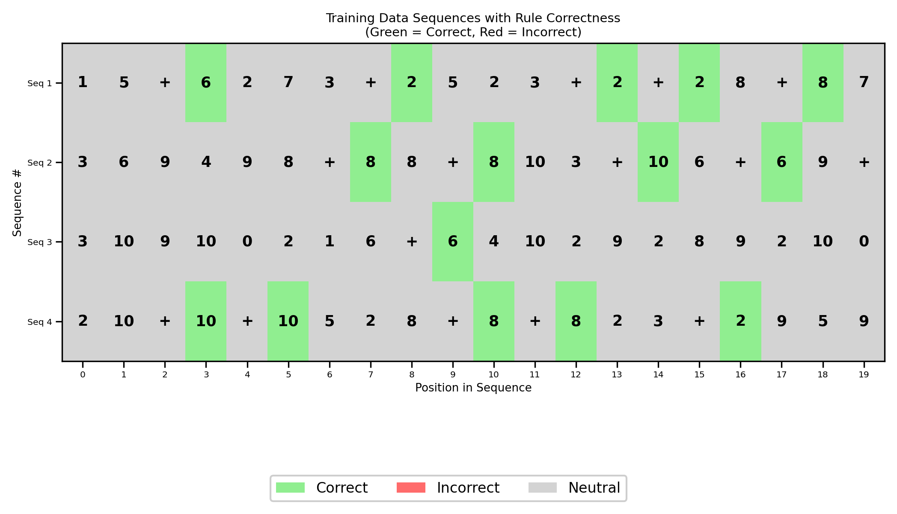
***Figure 2.** Sample training sequences as heatmaps. Green: constrained position (immediately after `+`) with the correct next token (the most recent even number). Gray: unconstrained position (any token is valid).*

Figure 3 shows the training dynamics over 20,000 steps. Cross-entropy loss drops steeply in the first ~2,000 steps, then continues to decrease more gradually. **Rule error** is the fraction of constrained positions (those immediately following `+`) where the model's top prediction is wrong; it drops from ~90% (chance for a 12-token vocabulary) to near 0%, indicating that the model has learned the rule.

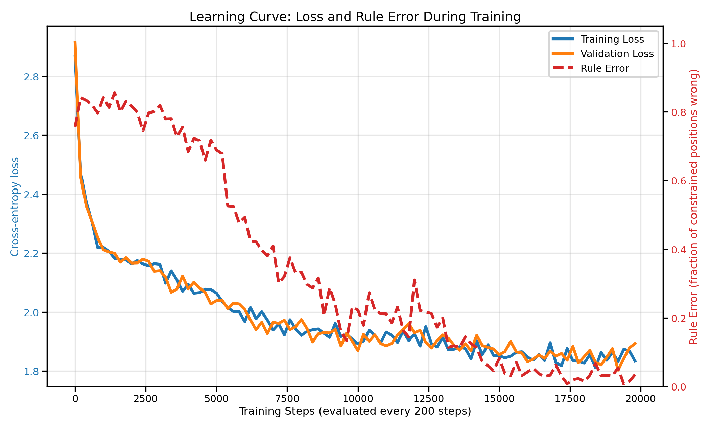
***Figure 3.** Training dynamics over 20,000 steps. Left axis: cross-entropy loss. Right axis: rule error — the fraction of constrained positions (tokens immediately following `+`) where the model's top predicted token is not the target (the most recent even number). Rule error near 90% is chance level; near 0% indicates the rule is learned.*

Figure 4 compares sequences generated by the model before and after training. The same color convention applies: at initialization (step 0), predictions at constrained positions are essentially random — most cells are red. After training, nearly all constrained positions are green: the model reliably outputs the most recent even number after every `+`. We now proceed to show how the model implements this rule.

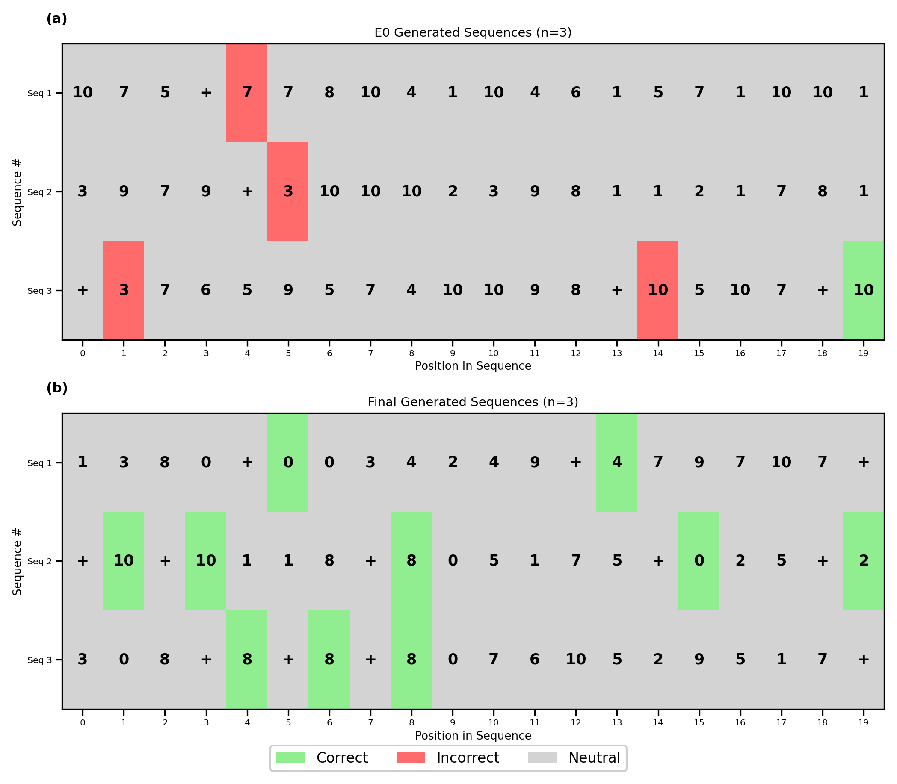
***Figure 4.** Model-generated sequences at initialization (top) vs. after training (bottom). green = correct at constrained positions (after `+`), red = wrong at constrained positions, gray = unconstrained. Top: at step 0, constrained positions are mostly red (random predictions). Bottom: after training, constrained positions are mostly green (correct "last even" outputs).*

### 3.2 The Embedding Space: How the Model Encodes Its Vocabulary

The first stage of the transformer maps each input token and position to a 2D vector. Figure 5 reveals that the learned embedding layer has already done significant organizational work before any attention occurs. In the token embedding scatter plot (Figure 5a), the six even numbers (0, 2, 4, 6, 8, 10) sit in a spaced formation at the top of the plane, the five odd numbers (1, 3, 5, 7, 9) bunch together in the center of the plane, and the `+` operator sits far from both groups as an isolated outlier. The model has discovered that the categories relevant to the rule — even numbers, odd numbers, and the operator — should occupy geometrically distinct regions. Moreover, the 'personal space' given to the even-digit tokens, as opposed to the bunched formation of the odd tokens, indicates that the distinct identity of the even tokens is more important for solving this task.

The position embeddings (Figure 5b) form a ladder structure, with $p_0$ at the bottom, $p_7$ at the top, and the other positions arranged in ascending order in between. This orderly arrangement allows the model to encode how far back a token is, which is essential for identifying the most recent even number. When token and position embeddings are summed (Figure 5g), each token fans out into eight copies — one per position — shifted vertically by the position embedding. Because the range of values of the position embeddings is smaller than the range of the token embeddings, the 'macro'-level geometry of the summed token+position embeddings retains the odd/even/'+' organization of the token embeddings, while the 'micro'-level geometry preserves the ladder structure of the position embeddings.

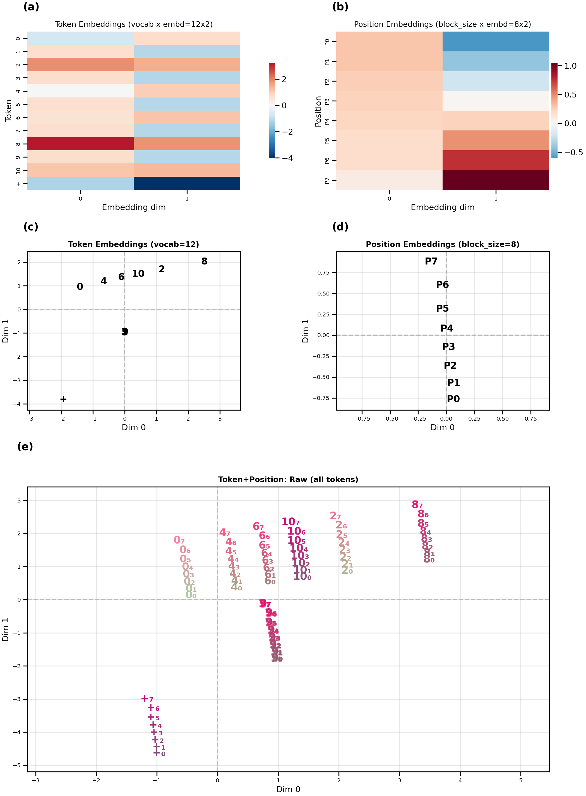
***Figure 5.** Learned embeddings. (a) Token embeddings $\mathbf{x_i}$ shown as heatmap. (b) Position embeddings  $\mathbf{p_i}$ shown as heatmap. (c) Combined token+position embeddings shown as scatterplot. (d) Positions $\mathbf{p_i}$ shown as scatterplot. (e) Token+position embeddings $\mathbf{e_i}$ shown as scatterplot. *

We emphasize that this geometric structure does not exist at initialization; it is learned. Movie 1 shows the embedding space at every checkpoint across training. At step 0, all points are randomly scattered. Within the first few thousand steps, the `+` token rapidly migrates away from the number tokens. The even/odd split solidifies between steps 5,000 and 10,000, and the position embedding ladder organizes gradually throughout training. 
### 3.3 The Attention Mechanism: Query, Key, and Value Projections

The combined embeddings $\mathbf{e}_i$ alone are not sufficient for the model to obey the plus-last-even rule, due to the rule's conditional structure: simply knowing the token value and its position is not enough to predict the next token. The '+' tokens need to "search back" for the most recent even number to generate the correct answer. This retrieval process is what motivates the use of the attention mechanism (Vaswani et al., 2017).

To illustrate how the attention mechanism works, consider what happens when the model encounters a `+` token and needs to retrieve the most recent even number. Each combined embedding $\mathbf{e}_i$ is linearly transformed into three vectors: a query ($q$), a key ($k$), and a value ($v$). For example, when processing $\mathbf{+}_{7}$ (the `+` token at position 7), the query vector represents the "search request" asking, "Where is the relevant even number?" Every other position in the sequence, including those with even numbers, supplies its own key and value vectors. The model computes the attention weights for the `+` token by taking the dot product between its query ($q$) and every other token's key ($k$). This produces a score indicating how strongly the `+` should attend to each past token—ideally, giving the highest score to the key corresponding to the most recent even number. The value vectors ($v$) determine what information can actually be retrieved—so the value for the most recent even number carries the identity of that number, which is then used to generate the correct output after `+`. In summary: the query and key machinery let the `+` "look back" specifically for even numbers (and, thanks to position information, for the most recent one), while the value machinery lets the model retrieve exactly which even number should be output.

The model applies three learned linear maps $W_Q, W_K, W_V \in \mathbb{R}^{d_k \times n_{\mathrm{embed}}}$ (here $2 \times 2$) to every combined embedding $\mathbf{e}_i$, producing query, key, and value column vectors in $\mathbb{R}^{d_k}$; for a batch of positions these form $\mathbf{Q}, \mathbf{K}, \mathbf{V} \in \mathbb{R}^{T \times d_k}$. Figure 6 shows these transformations and their effect. Panel (a) displays the original combined token+position embeddings (all 96 points in embedding space). Panels (b), (c), and (d) show the same points after projection into query space (blue), key space (red), and value space (green).

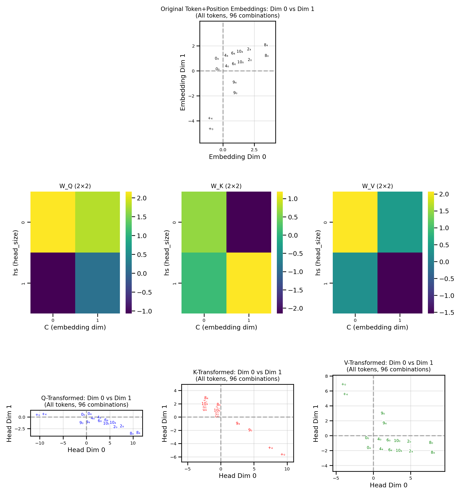
***Figure 6.** QKV projections. (a) Original combined token+position embeddings. (b) Query-space (blue), with $W_Q$ inset. (c) Key-space (red), with $W_K$ inset. (d) Value-space (green), with $W_V$ inset. All 96 token+position points in each panel.*

### 3.4 Who Attends to Whom: The Query–Key Geometry

When the model encounters a `+`, how does it know to look back and find the most recent even number? The answer lies in the geometry of the query–key space. Figure 7 plots all 96 query vectors (blue) and all 96 key vectors (red) on common axes, so we can directly read off the attention pattern from the spatial relationships.

Figure 7 (Top) makes this geometry visible. The `+` queries form a tight single-file cluster well-separated from all number queries. Even-number keys are concentrated in the region closest to that `+` cluster, while odd-number keys lie in a distinctly different region, far from it. This spatial arrangement is the geometric encoding of the rule's core requirement: `+` should attend to even numbers and ignore odd numbers. 

But the rule demands more than just "attend to even numbers" — it requires attending to the *most recent* one. This is encoded in the positional spread of each token's keys. Within the key cluster for any given even number, keys at later positions (closer to the query) are arranged so that they are closer to the `+` queries than keys at earlier positions. 

If we focus on a single query $\mathbf{+}_5$ (`+` at position 5), we can see the dot product (green background) between that query and a key at any point in space (Figure 7 Bottom). In principle, the dot product is highest with even numbers at position 7, however, because of the causal masking, queries are only allowed to look at keys that come before it in the sequence, so we have grayed out all keys that come before position 5 (keys in positions 5 are also grayed out because if there's a plus in position 5, no other token could be in position 5). The `+` query thus acts as a selective filter that picks out even-number keys from the past context, with recency biasing the selection toward the most recent one.

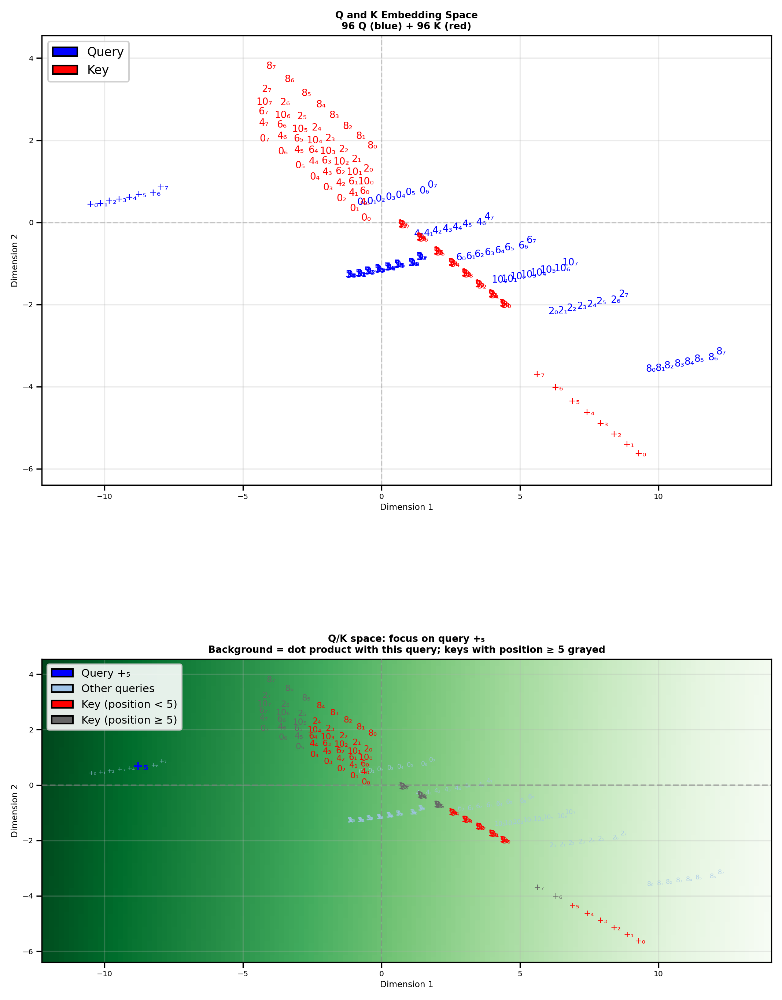
***Figure 7.** Query–key geometry in Q/K space. **Top:** joint query–key space (blue: queries; red: keys; labels show token and position). **Bottom:** dot-product landscape for the query `+` at position 5; background color is $\mathbf{q}_{+_5}^\top \mathbf{k}$, and keys with position $\geq 5$ are grayed by the causal mask.*

Movie 4 reveals how this structure develops over the course of training. At initialization, queries and keys are intermingled with no meaningful separation. Over the first several thousand steps, the `+` queries begin migrating away from the number queries. Simultaneously, even number keys separate from odd-number keys along the axis that aligns with the `+` query direction. By the end of training, the geometry has converged to the configuration described above: a clear `+` query cluster aligned with even-number keys and orthogonal to odd-number keys.


Because Figure 8 is not tied to a specific input sequence, we can not produce a true attention matrix (which would require having only a single token in each position). However, we can calculate the raw query–key scores $QK^T$: the dot product between every possible query vector and every possible key vector. To focus on the rule-relevant structure, Figure 8 shows only the blocks where the **query token is `+`**. Each subplot is an 8×8 grid: rows index the **position of the `+` query**, and columns index the **position of the key** for the indicated key token. Even-number key blocks score consistently higher than odd-number key blocks, showing that `+` queries score even keys more strongly across positions. (The full all-query $QK^T$ matrix is included in the Supplementary Figures). Moreover, tokens at later positions receive higher dot product scores than tokens at earlier positions. This confirms the observation from Figure 7 that the geometry of the key/query space allows the `+` tokens to attend to most recent even tokens.


***Figure 8.** Pre-softmax query–key scores \(QK^\top\), restricted to `+` queries. Each subplot shows an 8×8 matrix of dot products: `+` query positions (rows) vs. key positions (columns) for a fixed key token.*

### 3.5 The Output Landscape: Where Representations Need to Land

Before examining the value transformation, we first characterize the output network through which all information must ultimately pass. This will help us better appreciate the purpose of the values.

The output network (FFN, second residual, and LM head, as defined in §2.2) maps a point $\mathbf{z}_i \in \mathbb{R}^2$ to a probability distribution over the vocabulary to generate the next token. Geometrically, this means that for each possible next token (the digits from 0 to 10 and the `+` operator), the 2D plane is partitioned into regions with different probabilities for predicting that token. (Because of the softmax, the probabilities across all tokens for a particular point in the 2D plane must sum to 1.) Figure 9 makes this partition explicit: each subplot shows the model's probability for a specific output token across the plane (yellow $\approx$ 1, purple $\approx$ 0).

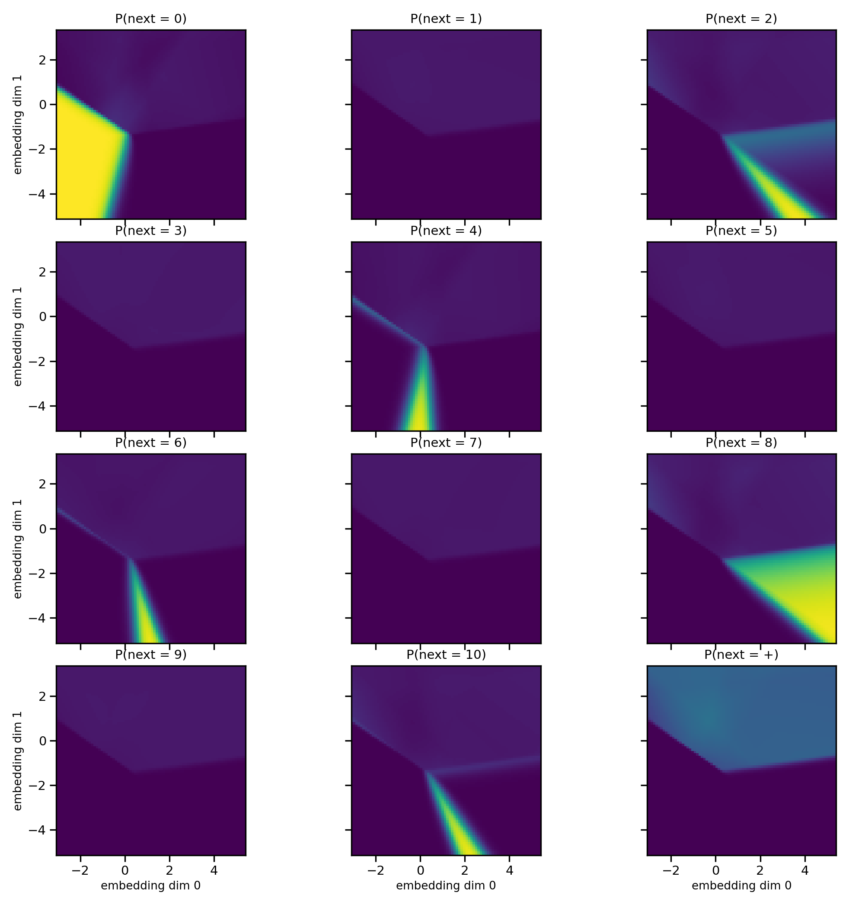
***Figure 9.** Output probability landscape (per-unit view). Each subplot shows the softmax probability $P(\text{next} = \text{token})$ over the 2D plane for one output token (digits 0–10 and the `+` operator). Yellow $\approx 1$, purple $\approx 0$.*

The output landscape and the embedding positions co-evolve during training (Movie 2). At initialization, the probability landscape is nearly uniform — no decision boundaries exist. As the model first learns token frequencies, broad regions form. These sharpen progressively into the final configuration where each even number has a well-defined, non-overlapping high-probability region. 

Figure 10 provides a compact summary of the landscape shown in Figure 9. Panel (a) shows the *entropy* of the output distribution: the upper half-plane has high entropy (many tokens are plausible), while the lower zones have near-zero entropy (a single even number dominates). Panel (b) shows the *argmax prediction map*: at every point in the plane, the color indicates which token the output network would predict most strongly.

Panels (a) and (b) together reveal a clear functional decomposition of the plane:

1. **Indifference region** (upper half-plane). No single digit is strongly favored. The `+` operator unit shows the highest probability here, reflecting the training distribution: `+` appears with probability 0.3 and can follow almost any digit, so the model assigns it a high baseline in this unspecialized zone.
2. **Strong specific-prediction region** (lower half-plane). This area is subdivided into distinct target zones, one for each even integer. In each zone, one even-number unit fires strongly while all others are nearly zero. This region is effectively reserved for the final retrieval of the correct even digit after a `+` sign.

Now that we understand how the output network maps a point $\mathbf{z}_i$ to a token prediction, we now consider the individual components of $\mathbf{z}_i$. Recall that $\mathbf{z}_i = \mathbf{e}_i + \mathrm{Attn}(\mathbf{e})_i$ where $\mathrm{Attn}(\mathbf{e})_i = \sum_{j=1}^{i} \alpha_{ij} \mathbf{v}_j$.
In other words, $\mathbf{z}_i$ can be thought of as being the sum of two constituent components, the embedding $\mathbf{e}_i$, which are passed via the residual stream, and an attention-weighted sum of values $\mathbf{v}_j$. It can thus be instructive to see how each of these components, i.e. the embeddings $\mathbf{e}_i$ and the values $\mathbf{v}_j$ are situated in the plane representing the network's output.

Panels (c) and (d) of Figure 10 overlay the embeddings $\mathbf{e}_i$ and the values $\mathbf{v}_j$, respectively on the argmax map (panel b) to reveal where they sit relative to the output network's decision regions. In panel (c), the 96 combined embeddings $\mathbf{e}_i$ (12 tokens $\times$ 8 positions) are plotted. The digit embeddings generaly fall in the high-entropy indifference region in the upper half-plane (visible in panel a), where no specific retrieval is triggered. In contrast, all `+` embeddings land in the lower half-plane — inside the strong prediction region — which provides a geometric headstart for the algorithm: the model has already categorized `+` as requiring an even-number output based on token identity and position alone. However, because the embeddings lack the context of the rest of the string, it can identify the *type* of output needed but cannot resolve the specific value. This defines the attention layer's objective: it must look back to find the most recent even number and produce a value vector that, when added to the residual stream, nudges the representation into the correct even-number target zone.

Panel (d) shows the value-transformed vectors $\mathbf{v}_j = W_V \mathbf{e}_j$ for all 96 combined token+position embeddings, overlaid on the same argmax map. We observe that the ordering of the value vectors on the plane in figure 10d is the same ordering as the even-digit prediction zones in Figure 10B. This illustrates that the purpose of the value vectors is to nudge the embeddings towards a particular zone in order to produce the correct output. However, *which* value specifically will be chosen depends on the attention matrix which requires a specific sequence.
(Per-unit heatmaps with embedding and value overlays are included in the Supplementary Figures.)

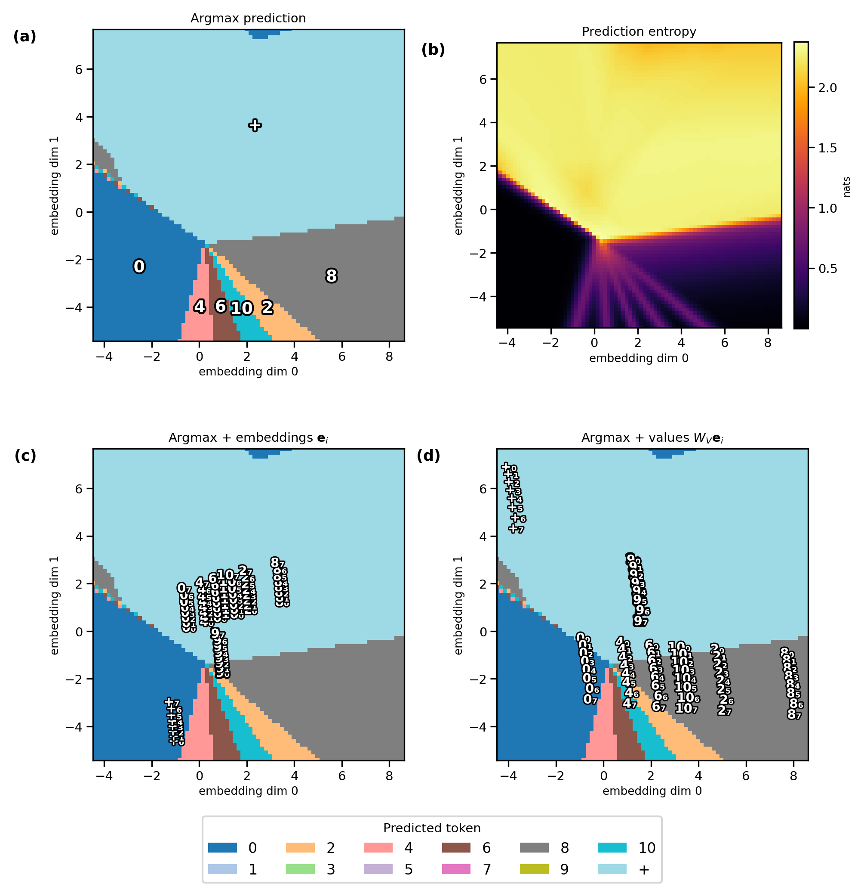
***Figure 10.** Output landscape summary (summary of Figure 9). (a) Entropy of the output distribution (nats); high in the indifference region (top half), near zero in even-number target zones (bottom half). (b) Argmax prediction map: color and annotation indicate which token has the highest predicted probability at each point. (c) Argmax map with combined embeddings $\mathbf{e}_i$ overlaid. (d) Argmax map with value-transformed vectors $\mathbf{v}_j$ overlaid.*

### 3.7 Tracing a Sequence Through the Pipeline

The preceding analysis characterized the model's learned parameters in the abstract — all 96 possible token+position combinations. We now ground this analysis by tracing a single concrete sequence, `4 1 + 4 6 9 5 +`, through the complete inference pipeline and verifying that each step works as expected.
This sequence ends in a `+` to illustrate next token prediction. The model's output for the next token in the sequence should be a 6.
**Embedding.** The embeddings for this sequence are a subset of the total set of token+positions embeddings, as there can only be one token in each position. Thus, this sequence uses only 8 out of the 96 total possible token+position combinations. In Figure 11, we show the tokens for this sequence against a backdrop of all 96 possible token+position combinations as shown in Figure 5.
As we showed earlier, the even, odd and `+` token embeddings are separated from each other in the embedding space, and the position of each token in the sequence determines where it appears in the "ladder" structure for that token.


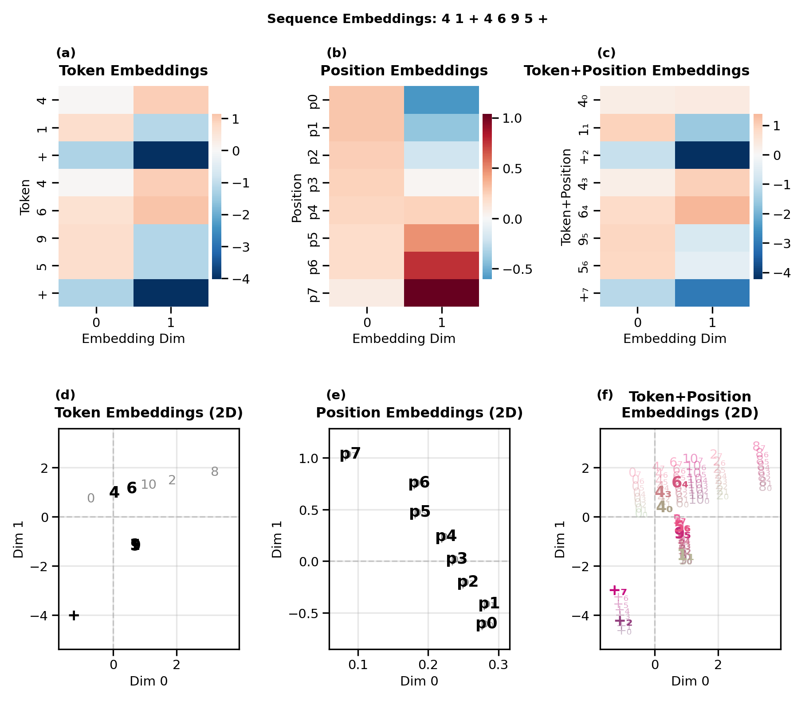
***Figure 11.** Embeddings for the demo sequence `4 1 + 4 6 9 5 +`. **a-c:** Embedding heatmaps for tokens, positions and token+position.
 **d–f:** 2D scatter plot views of tokens, positions, and token+position combinations, shown over a backdrop of all possible tokens, position, and token+position embeddings (light gray).

**Attention.** The model must compute the attention matrix for this sequence by forming $\mathbf{Q}, \mathbf{K} \in \mathbb{R}^{T \times d_k}$ for the $T$ positions and taking dot products between query rows and key rows (equivalently, the matrix $\mathbf{Q}\mathbf{K}^\top$). Figure 12 shows the Q and K heatmaps for the representation of the tokens within this sequence, and panel c shows these Q and K embedding on the same scatterplot against a backdrop of all 96 possible queries and keys, as in Figure 7.

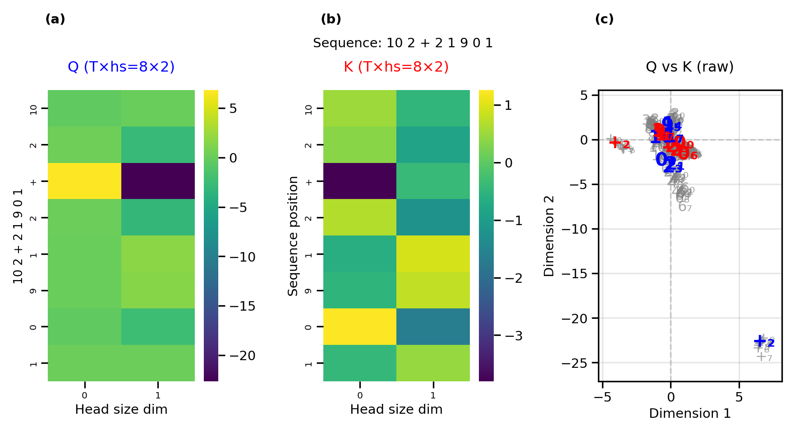
***Figure 12.** Attention computation for the demo sequence. (a) Q heatmap, (b) K heatmap, (c) scatterplot of queries (blue), and keys (red) for tokens within our test sequence against a backdrop of all 96 possible queries and keys (gray).*

For each token within the sequence, the model should compute the dot product between that token's query and the key of every token in the sequence. To illustrate this, for each query we show what the dot product with that query would be at an arbitrary point in space. We then overlay the actual keys within our test sequence over this space for each query, making it clear which keys would produce the largest dot product.
For each query, we also gray out the keys that come in later positions to show the effect of the causal masking.
It is apparent from these visualizations that once causal masking is applied, the dot product between the query of each `+` token and the key of the most recent even number relative to that `+` token, will be the largest for that query relative to other unmasked keys. We can verify this by looking at the heatmap of Figure 13b, which shows the masked query-key dot products. If we look at the rows for the two `+` tokens that appear in the sequence, each of those rows has the largest value in the column belonging to the most recent even number relative to that `+`token. Once we generate the final attention matrix via normalization by ${\sqrt{d_k}}$ and applying softmax, it is clear that the `+` tokens attend to their respective most recent even numbers (Figure 13c).

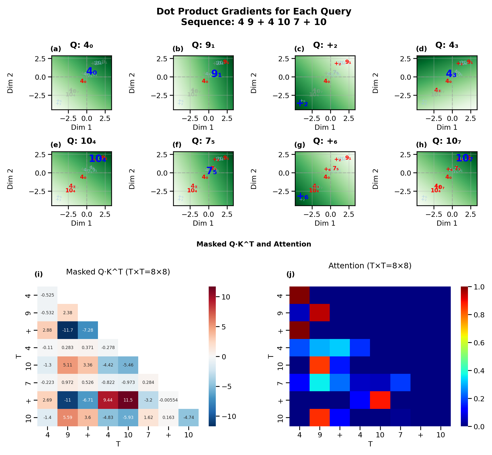
**Figure 13.** (a) The background of each panel displays the dot product of a specific query (blue) in the test sequence with every point in space (green = high, white = low). The unmasked (red) and masked (gray) keys are overlayed on this space to show their dot products with the selected query. (b) the  masked $Q \cdot K^\top$ matrix, (c) the attention matrix after normalization by ${\sqrt{d_k}}$ and applying softmax.

**Value routing.** Now that we have the attention weight matrix $\mathbf{A}$, we need to apply it to the value vectors in order to produce the attention vector for each token $\mathrm{Attn}(\mathbf{e})_i$. Specifically, the attention vectors are the attention-weighted sum of the value vectors for each token, i.e. $\mathrm{Attn}(\mathbf{e})_i = \sum_{j=1}^{i} \alpha_{ij} \mathbf{v}_j$. We can generate a matrix whose rows are the embeddings for each vector by multiplying the attention weight matrix $\mathbf{A}$ (Figure 14A) by the value matrix $\mathbf{V}$ (Figure 14B) such that we have $\mathrm{Attn}(\mathbf{e})_i^\top = (A \mathbf{V})_{i,:}$ (Figure 14C). We also show the value vectors $\mathbf{v}_j$ (Figure 14D) and attention vectors $\mathrm{Attn}(\mathbf{e})_i$ as scatter plots. The attention weights for each token here effectively select value vectors to be used for the prediciton; the attention vectors for the `+` tokens for example, are basically copies of the value vectors of the most recen even number. 

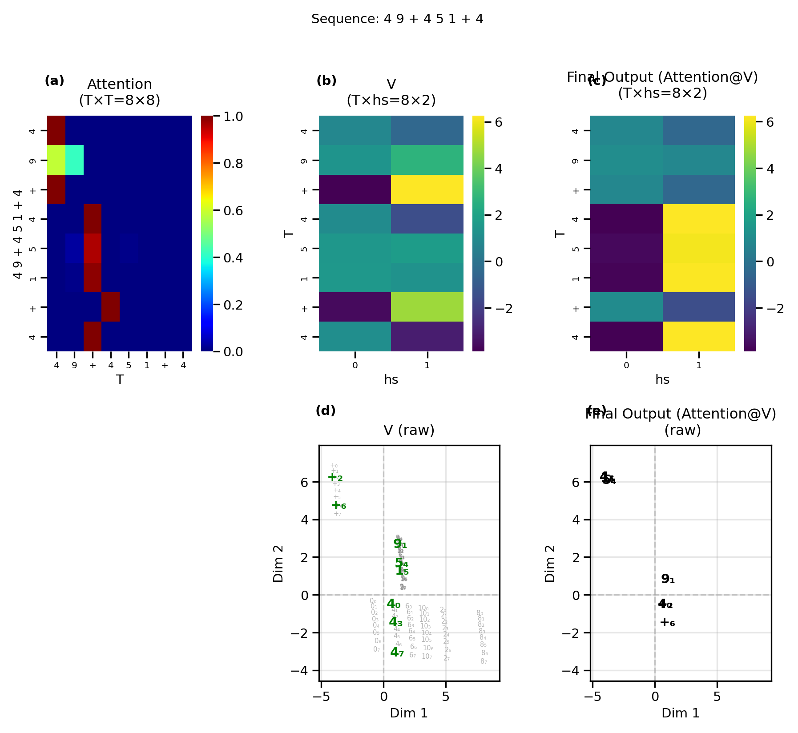
***Figure 14.** Value pathway for the demo sequence. Panels: attention weights, V vectors, attention output, V scatter, output scatter.*


**Predicting the next token.** Now that we have the attention vectors $\mathrm{Attn}(\mathbf{e})_i$ for each embedding, we are ready to predict the next token in our test sequence. (Actually, a next-token prediction is constructed for each token in the sequence). For the token at postion $i$ in the sequence, we first compute  $\mathbf{z}_i = \mathbf{e}_i + \mathrm{Attn}(\mathbf{e})_i$. In other words, we add the token's attention vector to its embedding and see where it lands in the output space. We can think of this addition as the original token+position embedding being nudged to the right zone in the output space by the attention vector. By showing the input embeddings, attention vectors, and their sums as both heatmaps and scatter plots (Figure 14), we observe that the embeddings for all digits are nudged toward the high-entropy region where all tokens are somewhat likely to occur, but the `+` token is the most likely prediction. The `+` embeddings, however, are nudged to the regions of the correct predictions for the most recent even number. The final token in the sequence, the `+` in position 7, correctly predicts that the next number in the sequence should be a 6, thus demonstrating that the transformer can correctly produce new tokens that were not part of the original sequence. 

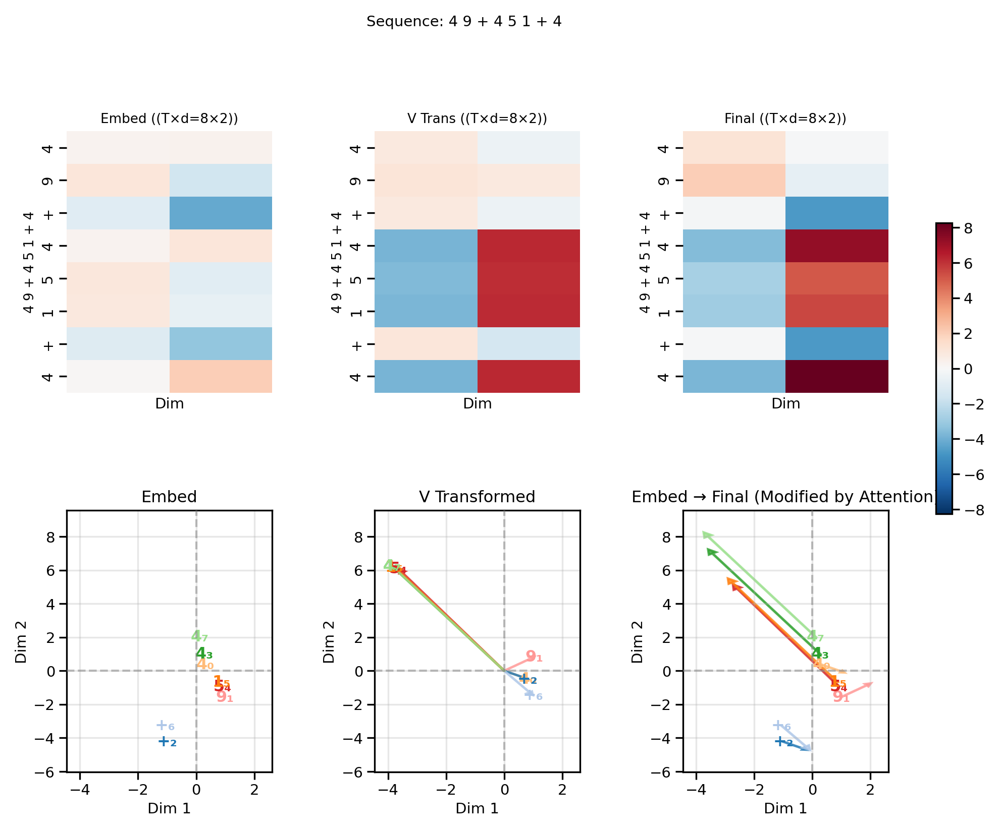
**Figure 15. Predicting the next token by summing the input embeddings and attention vectors.** 
(a) Top: Heatmaps illustrating the 2D values for the input embeddings ($\mathbf{e}$) for each token in the test sequence. Bottom: Input embeddings in the 2D output space, where the background colors represent the most likely next-token prediction. (b) Top: The attention vectors ($\mathrm{Attn}(\mathbf{e})$)
Bottom: The attention weights shown as arrows from the origin.
(c) Top: The sum of the input embeddings and the attention vectors ($\mathbf{z}$) as heatmap.
Bottom: Input embeddings (white annotations) are moved by the attention vectors (arrows) to the correct region for predicting the next token.

---

## 4. Geometry as Algorithm: Summary

For the plus-last-even rule, the model's behavior decomposes into a five-step algorithm. Each step corresponds to a specific geometric structure visible in the preceding figures.

1. **Encode.** Map each (token, position) pair to a 2D point: token embedding $\mathbf{x}_i$ plus position embedding $\mathbf{p}_i$ gives the combined embedding $\mathbf{e}_i = \mathbf{x}_i + \mathbf{p}_i$. The embedding scatter plots (Figure 5) show this mapping, with even numbers, odd numbers, and `+` occupying distinct regions.

2. **Detect the operator.** The query projection $W_Q$ maps the `+` embedding to a query vector that is geometrically distinct from number queries (Figure 7, top).

3. **Retrieve the last even number.** The dot product between the `+` query and all keys (produced by the $W_K$ projection) yields high attention weight for even-digit keys, with recency encoded in the positional component of the key layout. The focused-query analysis (Figure 7, bottom) and full attention matrix (Figure 8) make this retrieval pattern explicit; the per-query gradient figure (Figure 13) shows it for the demo sequence.

4. **Produce attention vectors.** Multiplying the attention matrix $\mathbf{A}$ by the value matrix $\mathbf{V}$ (generated by the $W_V$ projection) produces a weighted sum of value vectors for each token. For the `+` tokens, attention selects the value vector of the most recent even-digit position.

5. **Use attention vectors to push embeddings into the correct output zone.** For each token, the attention vectors are added to the original token+position embedding in order to nudge that token's representation now with the context of the other tokens, into the correct zone for the prediction of the next token. In the case of the `+` tokens, the `+` embeddings are nudged into the direction of the zone of the most recent even number.

We have thus demonstrated how the representational geometry of the transformer (Vaswani et al., 2017) can be directly interpreted to solve the plus-last-even rule.

---

## 5. Discussion

**Conclusions and implications.** By selecting a sufficiently simple task, the plus-last-even task, we have shown that it is possible to train a transformer with a dimensionality of 2 for the embedding size and head size to near-perfect accuracy. This low dimensionality enables us to inspect the learned internal information geometry of the transformer at every step in the architecture. This approach enables complete mechanistic interpretability: rather than only observing what the model predicts, we can trace exactly how the computation is organized inside the network and verify the algorithm without the need for dimensionality reduction.

**Limitations.** The primary limitation of this approach is the representational capacity of the 2D plane. While $\mathbb{R}^2$ is sufficient for the 12-token plus-last-even task, it would not be effective for more complex conditional rules, and certainly not for full-fledged AI tasks such as language modeling. Furthermore, this study is restricted to a single-layer, single-head architecture. In deeper models, the interaction between successive residual updates and FFN transformations introduce topological complexities that are harder to interpret as a single-step geometric nudge toward a decision boundary. 

**Future directions.** The plus-last-even task is an artificial task that was chosen for pedagogicial purposes to illustrate various facets of the transformer computation. Additional tasks including certain simple mathematical or logical operations can potentially also be solved using our minimal transformer architecture. The internal representations learned when solving different tasks can provide further insight into how transformers use information geometry to approach different kinds of problems. Moreover, transformers trained on the same tasks but with different random seeds can provide insight into what aspects of the information geometry are necessary to solve a task versus what aspects are left up to the model's "creative discretion". Comparing such trajectories to analyses of clustering, alignment, and emergent structure during training in other low-dimensional, algorithmic settings (Musat, 2024) may help isolate what is generic to optimization in $\mathbb{R}^2$ versus what is architecture- or task-specific. 

Although our work emphasized using 2-dimensional latent spaces for the purpose of complete interpretability, the visualization approaches that we used here can also be applied to more complex models if dimensionality reduction techniques are used and steps are taken to isolate the representations at each layer.  

Neuroscientists have become increasingly interested in relating the representational geometry of complex perceptions and behaviors in the brain to those found in large language models (e.g., Caucheteux et al., 2021; Hosseini et al., 2022; Sun et al., 2025; Doerig et al., 2025). Our framework allows for the possibility of exploring representational geometry in sufficiently simple tasks that can also be used in experimental neuroscience, potentially enabling for a direct comparison of neural activity to the transformer's internal representations.

---

## 6. Movies

The following animations show the evolution of the model's learned geometry over the course of training (one frame per checkpoint, 200 frames total). These are available as GIF/MP4 files in `plus_last_even/plots/learning_dynamics/`.

\noindent
\begin{tabularx}{\linewidth}{@{}l>{\raggedright\arraybackslash}p{3.5cm}>{\raggedright\arraybackslash}X@{}}
\toprule
Movie & \texttt{File} & Description \\
\midrule
Movie 1 & \parbox[t]{3.5cm}{\raggedright\ttfamily\seqsplit{01\_embeddings\_scatterplots.gif}} & Evolution of token, position, and combined embedding scatter plots. The \texttt{+} token separates from numbers first; the even/odd split solidifies by step 5,000--10,000. \\
Movie 2 & \parbox[t]{3.5cm}{\raggedright\ttfamily\seqsplit{05\_output\_heatmaps\_with\_embeddings.gif}} & Co-evolution of the LM head's output probability landscape and embedding positions. Decision boundaries sharpen progressively from a uniform initialization. \\
Movie 3 & \parbox[t]{3.5cm}{\raggedright\ttfamily\seqsplit{02\_embedding\_qkv\_comprehensive.gif}} & Specialization of the Q, K, and V subspaces. All three projections are initially identical and develop distinct geometry as training progresses. \\
Movie 4 & \parbox[t]{3.5cm}{\raggedright\ttfamily\seqsplit{03\_qk\_embedding\_space.gif}} & Separation of query and key subspaces. \texttt{+} queries migrate away from number queries; even-number keys align with the \texttt{+} query direction. \\
Movie 5 & \parbox[t]{3.5cm}{\raggedright\ttfamily\seqsplit{04\_qk\_space\_plus\_attention.gif}} & Evolution of the full attention matrix alongside the Q/K scatter. The \texttt{+}-row entries concentrate on even-number columns over training. \\
\bottomrule
\end{tabularx}

### Supplementary Figures

Additional static figures in `plus_last_even/plots/supplementary/` and `plus_last_even/plots/extended/`:

\noindent
\begin{tabularx}{\linewidth}{@{}>{\raggedright\arraybackslash}p{3.2cm}>{\raggedright\arraybackslash}X@{}}
\toprule
\texttt{File} & Description \\
\midrule
\parbox[t]{3.2cm}{\raggedright\ttfamily\seqsplit{supplementary/07\_qkv\_overview.png}} & Comprehensive 3$\times$3 panel: token, position, and combined embeddings; Q/K/V transformed spaces; Q+K overlay; and attention output. \\
\parbox[t]{3.2cm}{\raggedright\ttfamily\seqsplit{supplementary/14\_attention\_matrix.png}} & Per-sequence attention matrices alongside LM head linear input, logits, and output probabilities for three demo sequences. \\
\parbox[t]{3.2cm}{\raggedright\ttfamily\seqsplit{supplementary/16\_value\_arrows.png}} & Value vectors (original, transformed, residual) for three demo sequences, with correctness indicated by green/red markers. \\
\parbox[t]{3.2cm}{\raggedright\ttfamily\seqsplit{extended/08\_qkv\_transforms\_extended.png}} & Extended QKV figure with per-dimension heatmaps (tokens$\times$positions) for Q, K, and V. \\
\parbox[t]{3.2cm}{\raggedright\ttfamily\seqsplit{a4/11\_qk\_full\_heatmap.png}} & Full 96×96 pre-softmax query–key score matrix \(QK^\top\) (dot products), covering all query tokens and positions vs. all key tokens and positions (no masking/softmax), organized as a 12×12 grid of token–token blocks. \\
\parbox[t]{3.2cm}{\raggedright\ttfamily\seqsplit{a4/07\_output\_probs\_embed.png}} & Per-unit output probability heatmaps with all 96 combined embeddings $\mathbf{e}_i$ overlaid (token + position labels). \\
\parbox[t]{3.2cm}{\raggedright\ttfamily\seqsplit{a4/12\_probability\_heatmap\_with\_values.png}} & Per-unit output probability heatmaps with all 96 value-transformed vectors $W_V \mathbf{e}_i$ overlaid. \\
\bottomrule
\end{tabularx}

---

## 7. Reproducing the Results

**Train and visualize:**
```bash
python main.py plus_last_even
```

**Visualize from an existing checkpoint:**
```bash
python main.py plus_last_even --visualize
```

**Visualize a specific training step:**
```bash
python main.py plus_last_even --visualize --step 5000
```

**Generate learning-dynamics videos:**
```bash
python main.py plus_last_even --video
python main.py plus_last_even --video-qkv
```

**Dependencies:** PyTorch, NumPy, Matplotlib, Pillow, imageio.

---

## References


- Clark, K., Khandelwal, U., Levy, O., & Manning, C. D. (2019). What does BERT look at? An analysis of BERT's attention. *ACL Workshop on BlackboxNLP*.

- Caucheteux, C., Gramfort, A., & King, J.-R. (2021). GPT-2's activations predict the degree of semantic comprehension in the human brain. *bioRxiv*. https://doi.org/10.1101/2021.04.20.440622

- Doerig, A., Kietzmann, T. C., Allen, E., et al. (2025). High-level visual representations in the human brain are aligned with large language models. *Nature Machine Intelligence*, *7*, 1220–1234. https://doi.org/10.1038/s42256-025-01072-0

- Gromov, A. (2023). Grokking modular arithmetic. *arXiv preprint* arXiv:2301.02679v1. https://arxiv.org/pdf/2301.02679

- Hosseini, E. A., Schrimpf, M., Zhang, Y., Bowman, S., Zaslavsky, N., & Fedorenko, E. (2022). Artificial neural network language models predict human brain responses to language even after a developmentally realistic amount of training. *bioRxiv*. https://doi.org/10.1101/2022.10.04.510681

- Liu, Z., Kitouni, O., Nolte, N., Michaud, E. J., Tegmark, M., & Williams, M. (2022). Towards understanding grokking: An effective theory of representation learning. *arXiv preprint* arXiv:2205.10343v2. https://arxiv.org/pdf/2205.10343

- Musat, T. (2024). Clustering and alignment: Understanding the training dynamics in modular addition. *arXiv preprint* arXiv:2408.09414v2.

- Nanda, N., Chan, L., Liberum, T., Smith, J., & Steinhardt, J. (2023). Progress measures for grokking via mechanistic interpretability. *arXiv preprint* arXiv:2301.05217v1. https://arxiv.org/pdf/2301.05217v1

- Radford, A., Narasimhan, K., Salimans, T., & Sutskever, I. (2018). Improving language understanding by generative pre-training. OpenAI. https://cdn.openai.com/research-covers/language-unsupervised/language_understanding_paper.pdf

- Sun, W., Winnubst, J., Natrajan, M., et al. (2025). Learning produces an orthogonalized state machine in the hippocampus. *Nature*, *640*, 165–175. https://doi.org/10.1038/s41586-024-08548-w

- van der Maaten, L. & Hinton, G. (2008). Visualizing data using t-SNE. *JMLR*, 9, 2579–2605.
- Vaswani, A., Shazeer, N., Parmar, N., Uszkoreit, J., Jones, L., Gomez, A. N., Kaiser, Ł., & Polosukhin, I. (2017). Attention is all you need. *Advances in Neural Information Processing Systems*, 30.
- Vig, J. (2019). A multiscale visualization of attention in the transformer model. *ACL System Demonstrations*.
- Wang, K., Variengien, A., Conmy, A., Shlegeris, B., & Steinhardt, J. (2022). Interpretability in the wild: A circuit for indirect object identification in GPT-2 small. *NeurIPS*.
- Welch Labs. (2025). *The most complex model we actually understand* [Video]. YouTube. https://www.youtube.com/watch?v=D8GOeCFFby4
