# Creating a Transformer: Mechanistic Interpretability from Scratch

This project trains **tiny transformer language models** on synthetic integer-string tasks and then produces an exhaustive suite of visualizations that expose *every learned parameter and computation* in the network. Because the models are deliberately minimal (2-dimensional embeddings, a single attention head, 12-token vocabulary), every weight matrix, embedding vector, attention pattern, and output probability can be plotted directly — no dimensionality reduction required.

The goal is **mechanistic interpretability**: understanding *how* the transformer solves a rule, not just *that* it solves it.

---

## Table of Contents

- [The Task: plus\_last\_even](#the-task-plus_last_even)
- [Model Architecture](#model-architecture)
- [Training](#training)
- [Figures (in order)](#figures-in-order)
  - [01 — Architecture Overview](#01--architecture-overview)
  - [02 — Learning Curve](#02--learning-curve)
  - [03 — Training Data](#03--training-data)
  - [04 — Generated Sequences](#04--generated-sequences)
  - [05 — Token Embeddings](#05--token-embeddings)
  - [06 — Output Probability Heatmaps with Embeddings](#06--output-probability-heatmaps-with-embeddings)
  - [07 — QKV Transformations](#07--qkv-transformations)
  - [08 — Q/K Embedding Space](#08--qk-embedding-space)
  - [09 — Q/K Space: Focused Query](#09--qk-space-focused-query)
  - [10 — Full Attention Matrix](#10--full-attention-matrix)
  - [11 — Probability Heatmap with V Values](#11--probability-heatmap-with-v-values)
  - [12 — Sequence Embeddings](#12--sequence-embeddings)
  - [13 — Q/K Attention (per-sequence)](#13--qk-attention-per-sequence)
  - [14 — Value & Output (per-sequence)](#14--value--output-per-sequence)
  - [15 — Residual Stream](#15--residual-stream)
  - [16 — Final on Output Heatmap Grid](#16--final-on-output-heatmap-grid)
- [Supplementary Figures](#supplementary-figures)
- [Other Tasks](#other-tasks)
- [Running the Code](#running-the-code)

---

## The Task: plus_last_even

The **PlusLastEvenRule** defines a conditional sequence rule over 12 tokens: the integers `0`–`10` plus the operator `+`.

**Rule:** Whenever a `+` appears in the sequence, the *next* token must be the **most recent even number** that appeared before that `+`.

Example:

```
5  3  8  7  +  8  10  2  4  +  4  ...
            ^-- last even = 8      ^-- last even = 4
```

Positions that do not follow a `+` are unconstrained — any token (number or `+`) may appear. This means the rule only *constrains* a fraction of all positions; the rest are "free" and serve as context. The model must learn to:

1. Identify when the current position follows a `+`.
2. Scan backward through the context to find the most recent even number.
3. Output that number with high probability.

This is a non-trivial attention task: it requires the model to route information from a *variable, content-dependent* past position to the present.

---

## Model Architecture

| Parameter | Value |
|-----------|-------|
| n<sub>embd</sub> | 2 |
| `block_size` | 8 |
| `num_heads` | 1 |
| `head_size` | 2 |
| `vocab_size` | 12 (0–10, +) |
| Feed-forward multiplier | 16x |
| Residual connections | Yes |

The model is a single-layer, single-head causal transformer:

```
Input -> Token Embedding + Position Embedding -> Self-Attention -> + residual ->
Feed-Forward -> + residual -> LM Head -> Softmax -> P(next token)
```

With n<sub>embd</sub> = 2, every internal representation lives in **2D** and can be plotted as a point on a plane. This is the key design choice that makes the model fully interpretable without PCA or other projection.

---

## Training

- **2,000 sequences** of length 20–50, with `operator_probability = 0.3`.
- **20,000 training steps**, batch size 8, learning rate 0.001.
- Checkpoints saved every 100 steps (200 checkpoints total), enabling smooth learning-dynamics videos.

---

## Figures (in order)

All figures are in `plus_last_even/plots/`. The walkthrough is structured as a journey through the model: we start with the big picture (architecture, training, data), move into the learned representations (embeddings, output landscape, attention subspaces), and finish by tracing individual sequences through the full inference pipeline. At key points, animated learning-dynamics GIFs show *how* these representations emerged during training.

---

### 01 — Architecture Overview

Before examining any learned parameters, we need a map of the territory. What are the components of this model, and how does data flow through them?

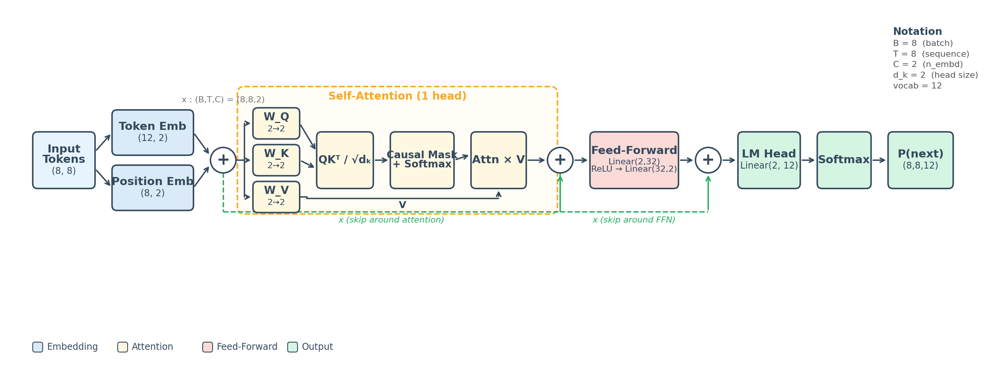

A schematic of the model's computation graph with exact tensor shapes. Every component is shown: input tokens, token/position embeddings, the single-head attention block (W<sub>Q</sub>, W<sub>K</sub>, W<sub>V</sub>, causal mask, softmax), the residual connection, the feed-forward network (Linear -> ReLU -> Linear), a second residual connection, and the final LM head that produces logits over 12 tokens. Notation in the upper-right maps symbols to actual dimensions (B=8, T=12, C=2, head_size=2, vocab=11).

This is the blueprint. Every subsequent figure zooms into one or more boxes in this diagram.

---

### 02 — Learning Curve

With the architecture in hand, the first question is: did the model actually learn the rule? We need to verify that training succeeded before dissecting any weights.


**Left axis (blue/orange):** Cross-entropy loss for training and validation sets over 20,000 steps. Loss drops steeply in the first ~2,000 steps (the model learns token frequencies), then gradually decreases as it learns the conditional rule.

**Right axis (red, dashed):** Rule error — the fraction of *constrained* positions (i.e., positions immediately after `+`) where the model's argmax prediction is wrong. This starts near 90% (random guessing among 12 tokens) and drops to near 0% by the end of training, confirming the model has learned the rule.

The loss curve tells us *when* learning happened; the next figures will reveal *what* the model learned.

---

### 03 — Training Data

Now that we know the model learned something, let's look at what it was trained on. Understanding the data distribution helps explain why the model develops certain representations.

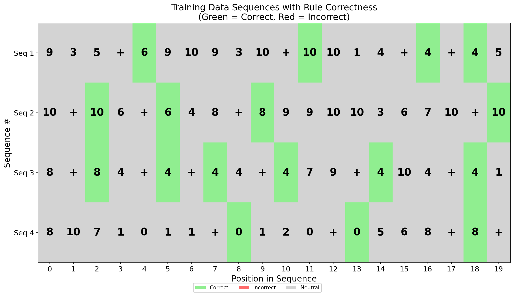

Four sample training sequences (positions 1–20) displayed as heatmaps. Each cell shows a token; **green** cells mark positions that are *correct* according to the rule, **red** marks incorrect, and **gray** marks unconstrained (free) positions. Since these are ground-truth training sequences generated by the rule, all constrained positions are green — confirming the data generator is correct. Notice how `+` tokens appear frequently (~30% probability) and the token after each `+` always matches the last even number.

---

### 04 — Generated Sequences

The real test: can the model *generate* sequences that follow the rule, not just predict the next token from ground-truth context? Comparing outputs before and after training shows the behavioral change.

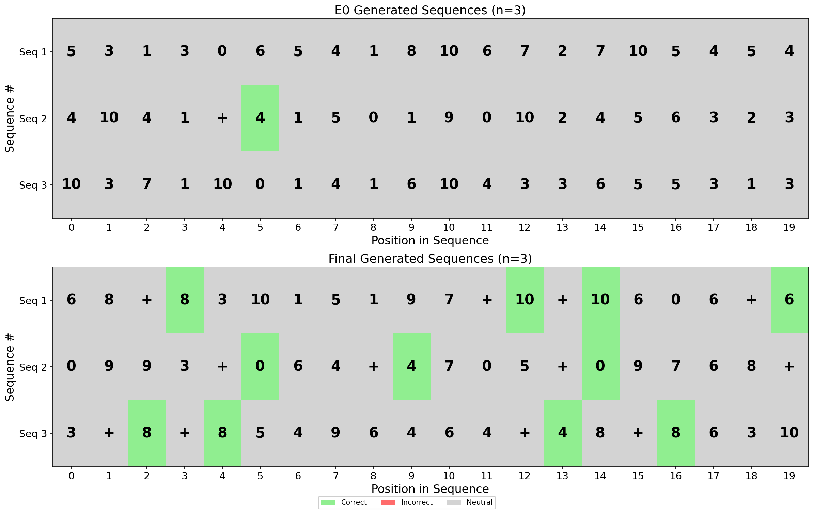

**Top panel (E0):** Sequences generated by the model at initialization (step 0), before any training. Predictions are essentially random — constrained positions are mostly red (wrong).

**Bottom panel (Final):** Sequences generated by the fully trained model. Almost all constrained positions are now green (correct). The model has learned to produce the most recent even number after every `+`. A few errors may remain on unconstrained positions, but the rule itself is reliably followed.

We've confirmed the model works. Now the interesting question: *how*? The next figures open the hood.

---

### 05 — Token Embeddings

The first stage of the transformer is the embedding layer. Each input token gets mapped to a 2D vector, and each position in the context window gets its own 2D vector. The sum of these two is the model's initial representation of "this token at this position." Since our embeddings are 2D, we can visualize them directly — this is where the model's understanding of the vocabulary begins.

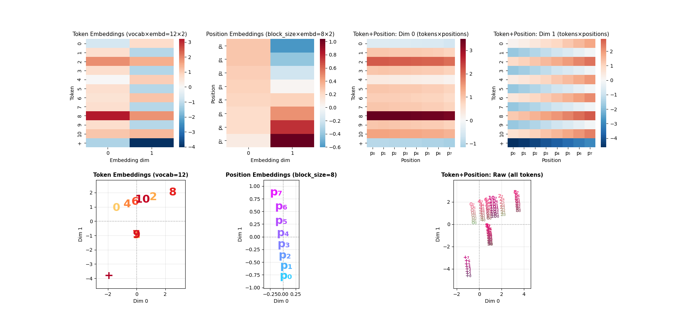

**Top row:** Heatmaps of the learned embedding matrices.
- *Left:* Token embeddings (12x2). Each row is one token's 2D vector. Notice that `+` (bottom row) has a very different embedding from all numbers — it lives far away in embedding space, which makes sense: `+` is functionally different from any number.
- *Center:* Position embeddings (8x2). Positions form a smooth gradient in dim 1, allowing the model to encode "how far back" a token is.
- *Right:* The sum of token and position embeddings (dim 0), showing how each token-position combination contributes to the first dimension.

**Bottom row:** 2D scatter plots of the same embeddings.
- *Left:* Token embeddings — even numbers (0, 2, 4, 6, 8, 10) cluster together in the upper region; odd numbers (1, 3, 5, 7, 9) cluster lower; `+` is an outlier far below. The model has learned to **separate even numbers from everything else**.
- *Center:* Position embeddings — positions form a vertical ladder (p0 at bottom, p7 at top), linearly arranged.
- *Right:* Token+Position sums — each token fans out into 8 copies (one per position), shifted vertically by the position embedding. Even-number groups are clearly separable.

Key takeaway: the embedding layer has already done meaningful work — it has organized the vocabulary so that the categories the rule cares about (even vs. odd vs. operator) occupy distinct regions of the plane.

**Learning dynamics:** How did this structure emerge? The animation below shows the embedding scatter plots at every training checkpoint (every 100 steps, 200 frames). At initialization the points are random. Within the first few thousand steps, `+` separates from the numbers. The even/odd split solidifies around step 5,000–10,000. Position embeddings slowly self-organize into their ladder structure.


---

### 06 — Output Probability Heatmaps with Embeddings

We've seen the input side (embeddings). Now let's jump to the *output* side: given a point in 2D space, what token does the model predict? This figure connects the geometry of the embedding space to the model's actual predictions. It answers: "if a representation ends up at coordinates (x, y) after all processing, what next token will the model output?"

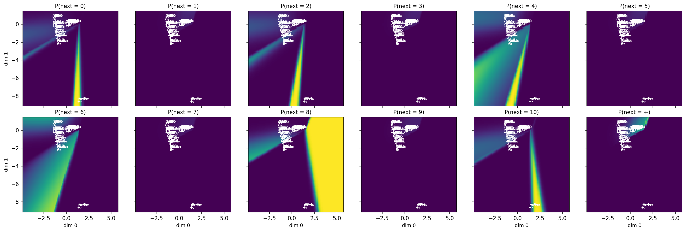

One subplot per output token (0 through 10, then `+`). Each subplot shows:
- **Background heatmap:** The probability that the model assigns to that token as the next-token prediction, evaluated at every point on the 2D embedding plane (after the feed-forward + residual pathway). Yellow = high probability, dark purple = near zero.
- **Text annotations:** All 96 token+position combinations (12 tokens x 8 positions) placed at their embedding-space coordinates.

Key observations:
- **P(next = 0):** High probability in the far-left region of embedding space — where `+` embeddings at low positions live. This means after a `+`, if the last even number was 0, the model correctly outputs 0.
- **P(next = 2), P(next = 6), P(next = 8), P(next = 10):** Each has its own high-probability "stripe" in a different part of the plane. The geometry of the even-number regions cleanly tiles the space where `+`-embeddings land after attention.
- **P(next = +):** High probability across the broad upper-right region where number embeddings live — the model predicts `+` when it sees numbers, matching the 30% base rate.

This figure directly shows how the LM head's linear decision boundaries partition the 2D plane into output-token regions. The remaining figures will explain how the model *moves* representations into the correct region using attention and the residual stream.

**Learning dynamics:** The output probability landscape and embedding positions co-evolve during training. At initialization the landscape is nearly uniform. Decision boundaries appear early (the model quickly learns token frequencies) and then sharpen into the final pattern where each even number has a distinct high-probability region.


---

### 07 — QKV Transformations

We've seen where tokens start (embeddings, Figure 05) and where they need to end up (output probability landscape, Figure 06). The bridge between them is self-attention. Attention uses three linear projections — Query, Key, and Value — to decide *what to attend to* and *what information to extract*. This figure shows those projections as learned 2x2 matrices and their effect on the embedding space.


**Top row:**
- *Far left:* Original token+position embeddings in 2D (all 96 combinations).
- *W<sub>Q</sub>, W<sub>K</sub>, W<sub>V</sub>:* The three 2x2 weight matrices as heatmaps. These are the learned linear transformations that create query, key, and value vectors from input embeddings.

**Bottom row:** The result of applying each weight matrix to all 96 token+position embeddings.
- *Q-Transformed (blue):* Queries — the model's "questions" for attention. Notice how the spatial structure has been rotated and stretched differently from the original embeddings.
- *K-Transformed (red):* Keys — the model's "answers" to be matched against queries. The W<sub>K</sub> matrix creates a *different* geometry from Q, so the dot product Q*K captures the desired content-based and position-based relationships.
- *V-Transformed (green):* Values — the information that gets routed through attention. The V space has its own structure, designed so that the attention-weighted sum of V vectors lands in the correct region of the output probability landscape.

**Learning dynamics:** The Q, K, and V subspaces must co-evolve. This animation shows all four spaces (embeddings in black, Q in blue, K in red, V in green) at every checkpoint. Early in training the four spaces are nearly identical. As training progresses, each develops specialized geometry — Q vectors for `+` end up pointing in directions with high dot product against K vectors for even numbers.


---

### 08 — Q/K Embedding Space

Figure 07 showed Q and K separately. Now we overlay them on the same axes to see the *relationship* between queries and keys. Attention weight between a query and a key is determined by their dot product, so the geometric relationship between blue (Q) and red (K) points directly reveals the attention mechanism.

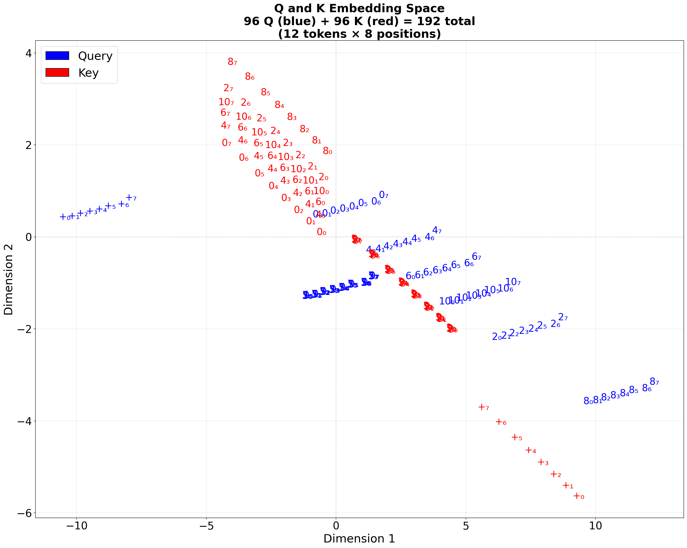

All 96 query vectors (blue) and 96 key vectors (red) plotted together. Each point is labeled with `token_position` (e.g., `8_7` = token 8 at position 7).

The dot product between a query and a key determines attention weight. Points that are **geometrically aligned** (in the same direction from the origin, or close together at large magnitude) will have high dot products, meaning the query will attend strongly to that key.

Key patterns:
- **`+` queries** (bottom-right cluster) are far from all number-keys, except for even-number keys at nearby positions — this is how the model learns to attend to the last even number.
- **Number queries** cluster together in a band, attending broadly to nearby tokens (for the unconstrained positions).
- Keys for positions 0–7 within each token are spread in a systematic way, encoding position information that allows the causal mask + dot-product geometry to implement "attend to the most recent."

**Learning dynamics:** The Q/K scatter at every checkpoint, showing how the query and key subspaces separate over training.


---

### 09 — Q/K Space: Focused Query

The full Q/K scatter (Figure 08) shows the global structure, but it's dense. To really understand what `+` attends to, we isolate a single query — `+` at position 5 — and color the entire plane by its dot product with that query. This turns the abstract "dot product determines attention" into a visible gradient.

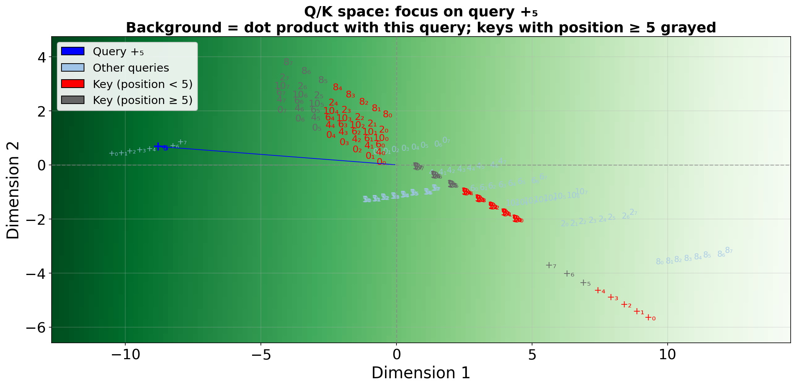

A focused view of the Q/K space for a single query: **`+` at position 5**. The background gradient shows the dot product of this query with every point in the plane — green = high attention, white = zero.

- The query `+_5` (blue, left) has high dot product with keys for even numbers at positions 0–4 (red), and much lower dot product with odd-number keys.
- Keys at positions >= 5 are shown in very light blue — they are masked by the causal mask (future tokens can't be attended to), so their dot products don't matter.
- This visualizes the **attention mechanism in action**: the `+` query selectively attends to even-number keys in the past.

---

### 10 — Full Attention Matrix

The focused query view (Figure 09) showed attention for one specific query. But what about *all* query-key pairs? This figure shows the complete attention score matrix for every possible token-position combination — all 96 queries against all 96 keys. This is the global view of what the model has learned about which tokens should attend to which other tokens.

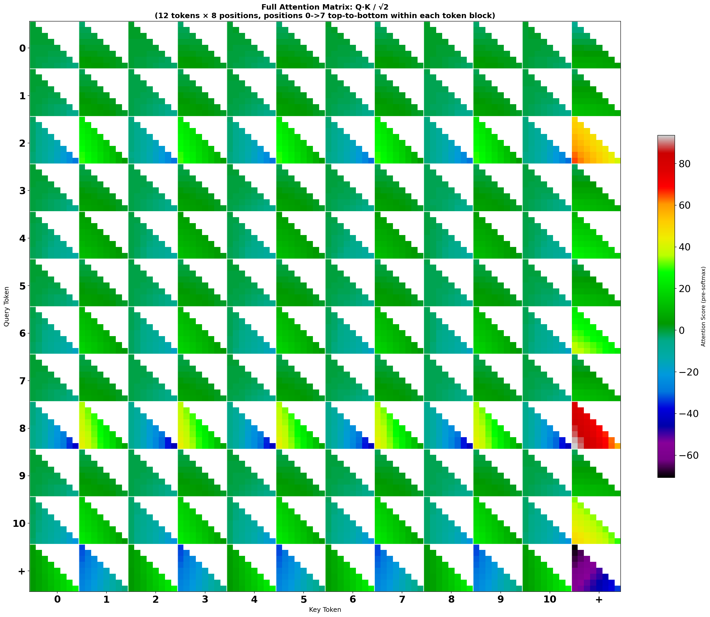

The full 96x96 attention score matrix (Q*K / sqrt(d<sub>k</sub>)), organized as a grid of small triangular heatmaps. Each cell in the 12x12 outer grid represents one query-token row vs. one key-token column. Within each cell, the 8 positions are arranged top-to-bottom (query) and left-to-right (key), with the upper triangle masked (causal mask).

Key patterns to look for:
- **Bottom row (`+` as query):** The `+` row shows which keys `+` attends to. Even-number key columns (0, 2, 4, 6, 8, 10) show warm colors (high attention), while odd-number columns show cool colors (low attention). This confirms the focused-query view from Figure 09 across all positions.
- **Diagonal blocks:** Same-token query-key pairs — these tend to have moderate-to-high scores, as the model also learns to attend to recent occurrences of the same token.
- **`+` as key (rightmost column):** Number queries attending to `+` keys show mostly low scores — the model doesn't need to route information from `+` to numbers.

**Learning dynamics:** The Q/K scatter alongside the full attention heatmap at every checkpoint. Early on, attention is diffuse. As training progresses, the Q/K geometry separates and the `+`-row entries concentrate on even-number columns.


---

### 11 — Probability Heatmap with V Values

Figure 06 showed the output probability landscape with the *input embeddings* (token+position sums) overlaid — i.e., where tokens start before attention. But the Value (V) transformation is what actually carries information through attention. This figure replaces the input embeddings with the **V-transformed** vectors (W<sub>V</sub> applied to each token+position), showing where the *value* representations sit relative to the output decision boundaries. When attention routes these V vectors, the weighted sum needs to land in the correct region.

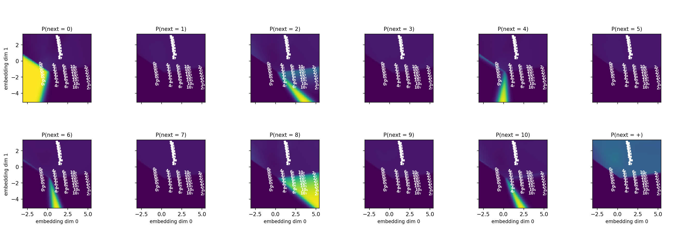

Same layout as Figure 06 — one subplot per output token, probability heatmap as background — but the overlaid annotations now show V-transformed token+position vectors instead of raw embeddings. The extent of the axes is expanded to cover both the embedding and V spaces.

Compare this to Figure 06: the V annotations have a different spatial arrangement. The model has learned a V transformation that places even-number values in regions where, after attention-weighted averaging, the result lands in the high-probability zone for the correct output token.

---

### 12 — Sequence Embeddings

So far we've looked at the model's learned parameters in the abstract — all 96 possible token-position combinations. Now we ground the analysis in a **concrete input sequence**. Before we can trace a sequence through the full pipeline (Figures 13–16), we need to see where its specific tokens land in embedding space.

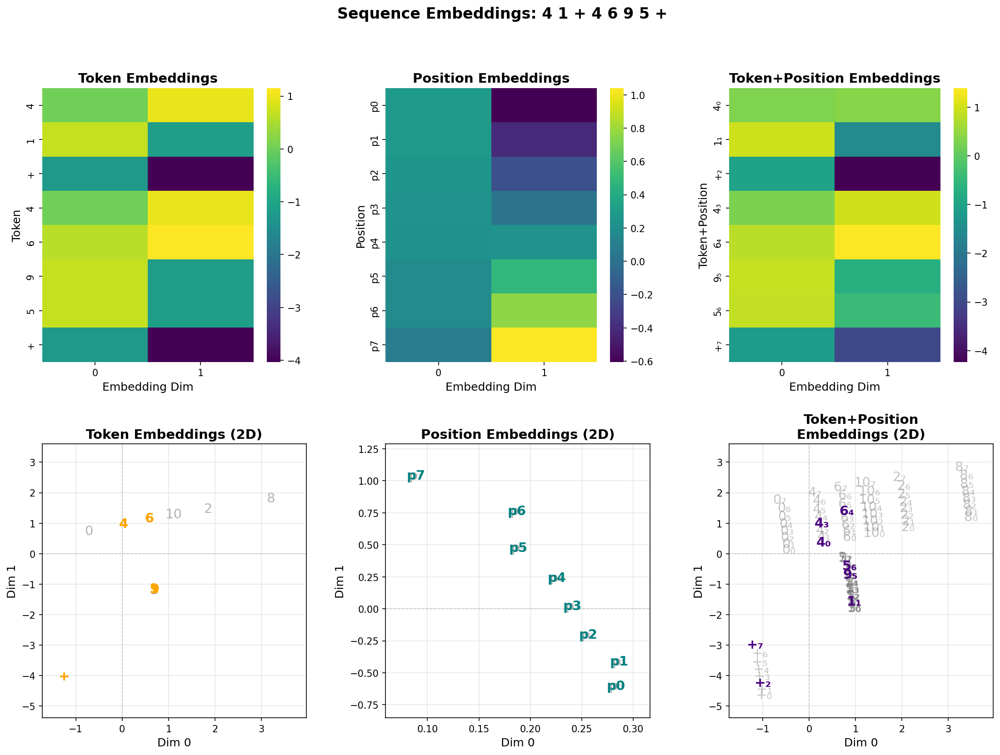

A concrete example for the sequence `10 + 10 6 + 6 4 8`.

**Top row:** Heatmaps of the token, position, and combined (token+position) embedding matrices, with the specific tokens in this sequence highlighted.

**Bottom row:** 2D scatter plots. The right panel highlights where each token-at-position in this specific sequence lands in the combined embedding space (colored labels), relative to all possible combinations (gray background). This grounds the abstract embedding space in a concrete input.

Notice the `+` tokens in the sequence (positions 1 and 4) are located far from the number tokens, exactly as the global embedding structure predicts. This concrete placement will determine the attention patterns in the next figures.

---

### 13 — Q/K Attention (per-sequence)

With the sequence's embeddings established, we now trace the first half of the attention mechanism: computing queries and keys, taking their dot product, applying the causal mask, and producing attention weights. This is where the model decides "who attends to whom" for a specific input.

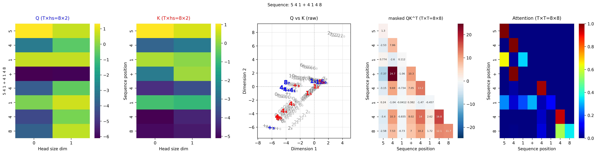

A single demo sequence shown across five panels:

1. **Q heatmap** (T x 2): Query vectors for each position in the sequence.
2. **K heatmap** (T x 2): Key vectors for each position.
3. **Q vs K scatter**: Q (blue) and K (red) vectors for this sequence in 2D. Gray background shows all 96 possible Q/K combinations for context.
4. **Masked QK<sup>T</sup>** (T x T): Raw dot-product attention scores, with future positions masked to negative infinity.
5. **Attention** (T x T): Softmax-normalized attention weights. Each row shows what each position attends to.

Look at the rows corresponding to `+` in the attention matrix — they concentrate weight on the positions containing even numbers, exactly as the Q/K geometry from Figures 08–09 predicts for real inputs.

---

### 14 — Value & Output (per-sequence)

Figure 13 showed *what* each position attends to. Now we complete the story: *what information* gets extracted from those attended positions and where does it land? The value transformation and attention-weighted sum determine the actual information routed through the network.

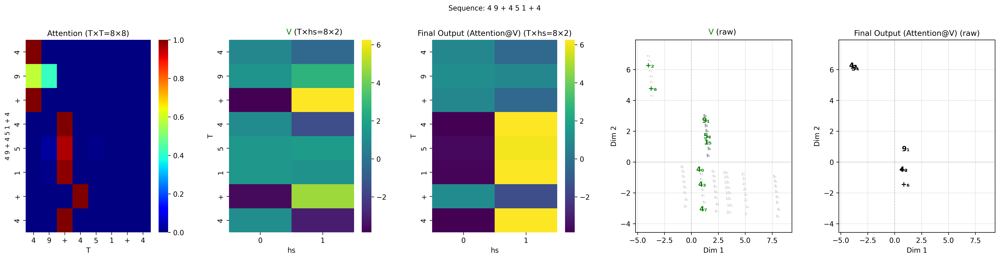

The same demo sequence, now shown across five panels focused on the value pathway:

1. **Attention** (T x T): Same attention matrix from Figure 13.
2. **V heatmap** (T x 2): Value vectors for each position.
3. **Final Output** (T x 2): The attention-weighted sum of V vectors (Attention @ V) — this is what gets added to the residual stream.
4. **V scatter**: Value vectors in 2D, with the current sequence's tokens highlighted (blue) against all possible V vectors (gray).
5. **Final Output scatter**: The actual Attention@V output vectors in 2D, showing where each position's representation lands after attention routing.

This completes the attention story: Figure 13 shows *what* the model attends to; Figure 14 shows *what information* gets extracted and where it lands in representation space. The final output vectors are what get added back via the residual connection — shown next.

---

### 15 — Residual Stream

Attention doesn't replace the input — it *adds to* it. The residual connection sums the original embedding with the attention output, creating a representation that combines "what token is here" with "what information was retrieved from the context." This figure visualizes that addition as arrows in 2D, showing exactly how attention nudges each position's representation.

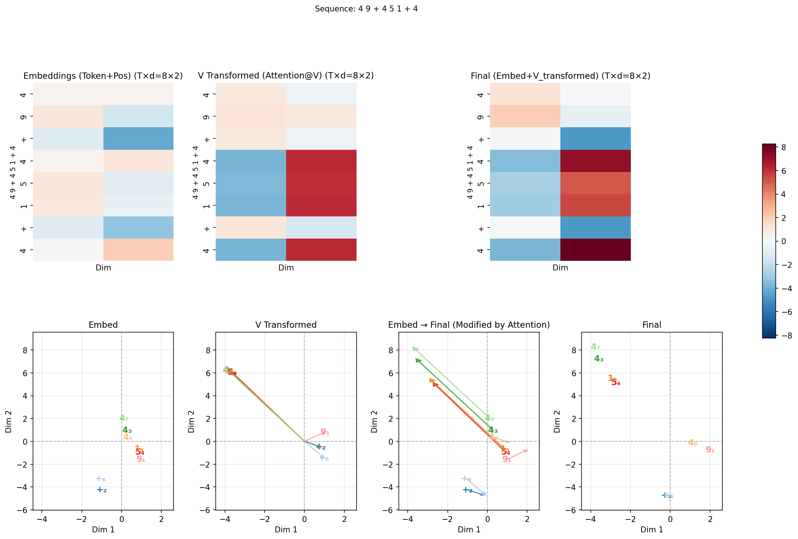

The same demo sequence, shown in a 2-row layout:

**Top row (heatmaps):**
1. **Embeddings** (token+position): The input to the attention layer.
2. **V Transformed** (Attention@V): The attention output.
3. **Final** (Embed + V_Transformed): The residual sum — the input to the feed-forward network.

**Bottom row (2D scatter plots):**
4. **Embed**: Where the input embeddings sit in 2D.
5. **V Transformed**: Where the attention output sits, with arrows from the origin showing the direction/magnitude of each value vector.
6. **Embed → Final (arrows)**: Arrows showing how the residual connection *shifts* each position's representation from its input location to its post-attention location.
7. **Final**: The post-residual representations that will be passed to the feed-forward network.

The arrow plot is the key panel: you can see the attention mechanism **moving** the `+` position's representation toward the region associated with the correct even number, while leaving unconstrained positions relatively undisturbed.

---

### 16 — Final on Output Heatmap Grid

Figure 15 showed the residual stream in abstract 2D space. But does each position's *final* representation actually land in the correct region of the output probability landscape? This figure answers that directly: it places the post-residual (embed + V_transformed) positions on top of the same P(next = token) heatmaps from Figure 06, arranged in a compact grid.

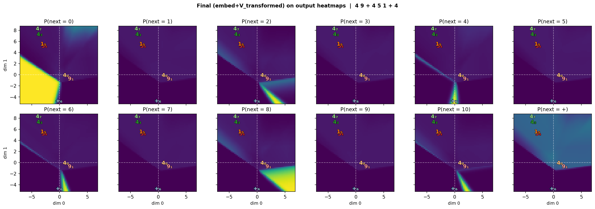

One subplot per output token (0–10, +), each showing:
- **Background heatmap:** P(next = token) over the 2D plane (same as Figure 06).
- **Overlaid labels:** The *final* (embed + attention output) position of each token in the demo sequence, colored by (token, position) — same color scheme as Figure 15.

This is the "proof" figure: for each `+` position, its final representation should sit in the high-probability region of the correct even number. For unconstrained positions, the final point can land anywhere. Compare this to Figure 06 (which shows *all* token+position embeddings before attention) — the difference is that these are the actual positions *after* the residual connection has moved them.

---

## Supplementary Figures

Located in `plus_last_even/plots/supplementary/` and `plus_last_even/plots/`. These provide alternative or more detailed views of the same concepts covered in the main figures.

| File | Description |
|------|-------------|
| `07_qkv_overview.png` | Comprehensive 3x3 view: token embeddings, position embeddings, token+position sum, Q/K/V transformed spaces, Q+K together, and attention output. An "everything at once" alternative to the separate Figures 07–08. |
| `14_attention_matrix.png` | Per-sequence attention matrices alongside the LM head's linear input, logits, and output probabilities for three demo sequences. Connects attention weights directly to output predictions. |
| `16_value_arrows.png` | V original, V transformed, and V+residual for three demo sequences, with each token-position in a unique color and correctness indicated by green/red. |

The `extended/` folder contains `08_qkv_transforms_extended.png`, which adds per-dimension heatmaps (tokens x positions) for Q, K, and V on top of the standard Figure 07.

---

## Other Tasks

The same framework supports multiple rules beyond `plus_last_even`. Each has its own config in `configs/` and output folder:

| Config | Rule |
|--------|------|
| `plus_last_even` | After `+`, output the most recent even number |
| `lucky7` | After `7`, output the token that appeared before the `7` |
| `step_back` | Each token is one less than the previous |
| `copy_modulo` | Copy with modular arithmetic |
| `plus_max_of_two` | After `+`, output the max of the two preceding numbers |
| `plus_means_even` | After `+`, output any even number |
| And more... | See `configs/` for the full list |

---

## Running the Code

**Train and visualize:**
```bash
python main.py plus_last_even
```

**Visualize only (from existing checkpoint):**
```bash
python main.py plus_last_even --visualize
```

**Visualize a specific training step:**
```bash
python main.py plus_last_even --visualize --step 5000
```

**Generate learning-dynamics videos:**
```bash
python main.py plus_last_even --video
python main.py plus_last_even --video-qkv
```

**Dependencies:** PyTorch, NumPy, Matplotlib, Pillow, imageio (for video/GIF generation).
